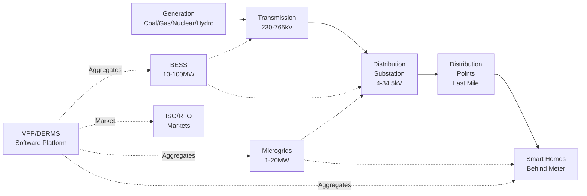
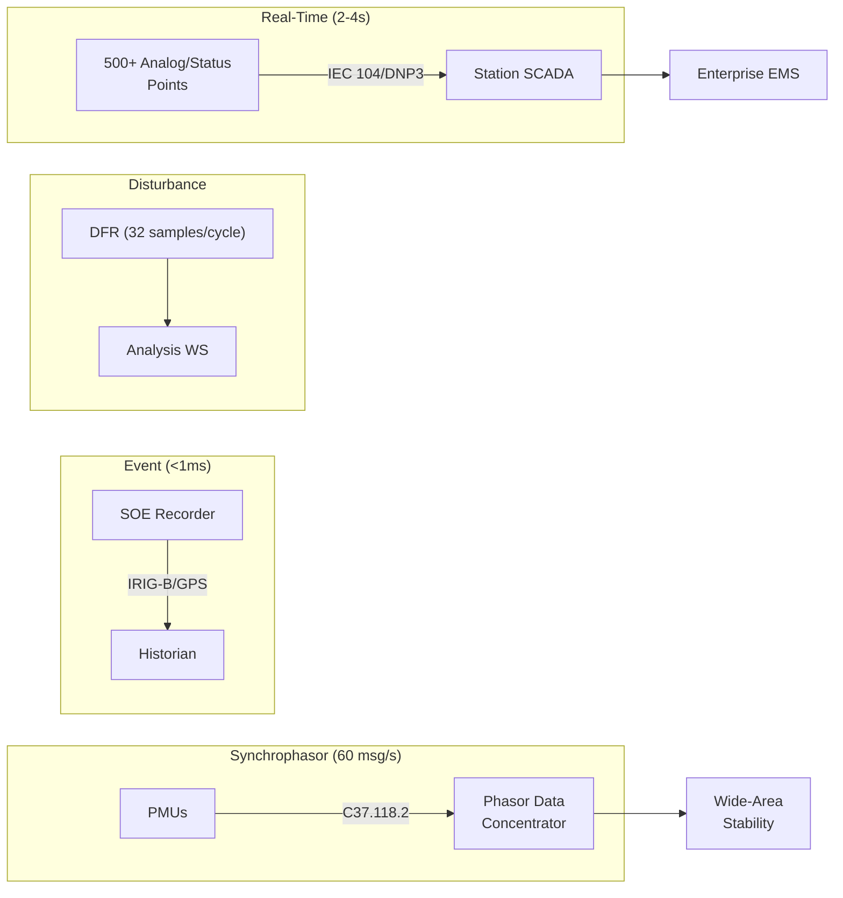
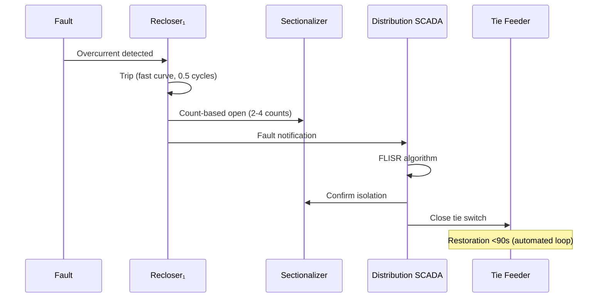
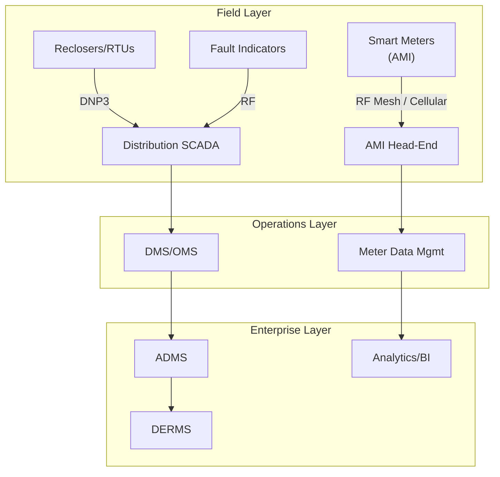
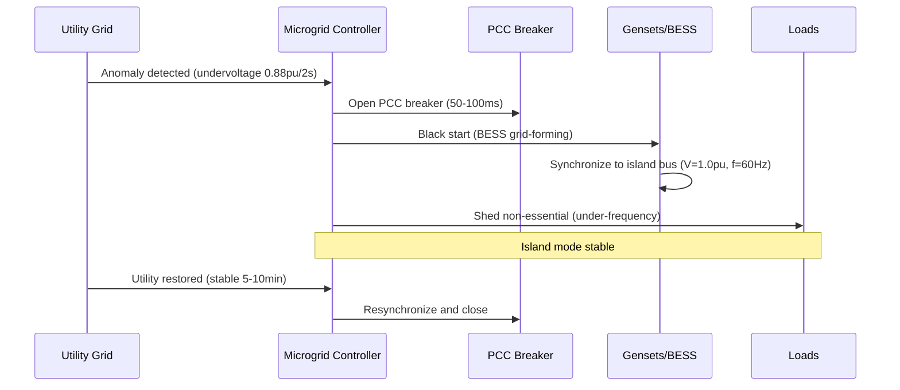

# Energy Sector Facilities Reference Report
## TOGAF-Based Reference Architectures, Process Diagrams & Bills of Materials

**Version:** 1.0  
**Date:** 12 February 2026  
**Classification:** DEXPI 2.0 Equipment Factory — Energy Sector Reference  
**Author:** OXOT Engineering — AI Agent Swarm (Perplexity Deep Research × 7 parallel specialists)

---

## Table of Contents

1. [Executive Summary](#1-executive-summary)
2. [Transmission Facilities (230kV–765kV)](#2-transmission-facilities)
3. [Distribution Facilities (4kV–34.5kV)](#3-distribution-facilities)
4. [Distribution Points (Last Mile)](#4-distribution-points)
5. [Microgrids (1–20MW)](#5-microgrids)
6. [Smart Homes (Smart Meter Hub)](#6-smart-homes)
7. [Battery Energy Storage Systems (BESS)](#7-battery-energy-storage-systems)
8. [Virtual Power Plants & DERMS](#8-virtual-power-plants--derms)
9. [Cross-Facility Integration Architecture](#9-cross-facility-integration)
10. [Appendices](#10-appendices)

---

## 1. Executive Summary

This report provides a comprehensive TOGAF-based reference architecture for seven major facility types within the Energy sector's electrical power value chain — from high-voltage transmission through last-mile distribution to behind-the-meter smart homes and utility-scale storage. Each facility chapter follows a consistent structure:

- **TOGAF Business Architecture** — Purpose, stakeholders, regulatory framework
- **High-Level Design** — One-line diagrams, bus configurations, system topology
- **Detailed Technical Description** — All major systems with specifications
- **Process Diagrams** — Energy flow, data flow, fault handling, control sequences
- **Bill of Materials** — Equipment types (not brand-specific) with quantities and ratings
- **Network Architecture** — Communication protocols, IEC 61850, SCADA, cybersecurity
- **Purdue Model Layers** — Level 0 through Level 4/5 mapping for each facility
- **Supporting Systems** — Fire suppression, HVAC, UPS, grounding, safety
- **Data Flow** — Telemetry, event recording, market signals, regulatory reporting
- **Energy/Water/Air/Gas Flow** — Physical process flows including cooling, ventilation, fire suppression

The report serves as the foundational reference for populating the DEXPI Equipment Factory with real Energy sector equipment across all sub-sectors.

### Scope of Facilities



---

## 2. Transmission Facilities

### 2.1 TOGAF Business Architecture

**Purpose:** Reliable high-voltage power transmission (230kV–765kV), voltage transformation, reactive power compensation, and grid stability within the bulk electric system.

**Stakeholders:**
- Transmission System Operators (TSOs) / Regional Transmission Organizations (RTOs)
- Independent System Operators (ISOs)
- Maintenance and protection engineers
- Regulatory bodies (FERC, NERC, state PUCs)
- Emergency responders and grid security personnel

**Regulatory Framework:**

| Standard | Scope |
|----------|-------|
| **NERC CIP** | Cybersecurity (CIP-005 electronic security perimeters, CIP-007 system security, CIP-010 configuration management) |
| **IEEE C37.2** | Device function numbers for protection and control |
| **IEEE C37.90** | Relay performance requirements |
| **IEC 61850** | Substation automation communication — process bus, station bus, GOOSE, MMS |
| **IEEE C57** | Power transformer standards |
| **IEC 62351** | Cybersecurity for power system communications |

### 2.2 High-Level Design

The high-level design features a **breaker-and-a-half bus configuration** for 230kV–765kV bays, providing redundancy with three circuit breakers per two lines/transformers, minimizing outages during faults. Alternative configurations include **double-bus** with bus tie breakers for sectionalizing.

**One-Line Diagram Description:**

```
765kV Overhead Lines
    │
    ▼
Surge Arresters → CT/PTs → Breaker-and-a-Half Bays
    │
    ▼
Autotransformer (765/345/34.5kV, 500MVA)
    │
    ├── 345kV Ring Bus → Outgoing Lines
    │
    ├── Step-Down Transformer (345/230kV)
    │       │
    │       ▼
    │   230kV Breakers → Capacitor Banks/Reactors
    │
    └── Auxiliary Transformer (34.5kV)
            │
            ▼
        Distribution Feeders / Station Service
```

**Protection Zones:** Line differential (87L), bus differential (87B), transformer differential (87T), overcurrent zones per bay, and breaker failure (50BF) schemes.

### 2.3 Detailed Technical Description

#### 2.3.1 HV Switchyard

The switchyard contains all primary equipment operating at 230kV–765kV. For extra-high-voltage (EHV) applications, **Gas-Insulated Switchgear (GIS)** using SF6 is employed for compact footprint; alternatively, **Air-Insulated Switchgear (AIS)** for conventional open-air layouts.

**Major Equipment:**
- **Circuit breakers** — SF6 puffer type, 765kV rated, 40.5kA interrupting capacity, 60-cycle duty
- **Disconnect switches** — Motor-operated, vertical-break, SF6/air-insulated
- **Instrument transformers** — Current transformers (CT) multi-ratio protection/metering class; Potential transformers (PT) and Coupling Capacitor Voltage Transformers (CCVT) for revenue/metering accuracy
- **Surge arresters** — Metal-oxide varistor (MOV), 765kV MCOV 600kV
- **Bus bars** — Aluminum tubular, 5000A continuous, rigid/flexible, isolated-phase for EHV
- **Insulators** — Porcelain/polymer post type, suspension strings for overhead bus
- **Grounding systems** — Copper mat/grid buried 1.5m, counterpoise for incoming lines
- **Capacitor banks** — 765kV switched shunt, 100 MVAR per bank
- **Reactors** — Series/shunt air-core, 765kV, 100 MVAR
- **Wave traps** — Line matching units for power line carrier (PLC) 500kHz–1MHz
- **CCVTs** — 765kV, 1000kV BIL for PLC coupling and metering

#### 2.3.2 Control Building

Houses all secondary/control equipment within a physically secure, NERC CIP-compliant perimeter:
- Protection relays (multifunction IEDs)
- Bay controllers and HMI workstations
- SCADA servers and Remote Terminal Units (RTUs)
- Engineering and configuration workstations
- Battery rooms (125V DC, 48V DC)
- UPS systems and diesel generator
- Communication equipment (fiber, microwave, PLC terminal)

#### 2.3.3 Protection & Metering

**Protection schemes** (per zone):
- **Line:** Distance (21), directional overcurrent (67), line differential (87L), permissive overreach (POTT)
- **Bus:** Bus differential (87B), overcurrent backup (50/51)
- **Transformer:** Differential (87T), sudden pressure, Buchholz, overcurrent
- **Breaker failure:** 50BF with 0.3–0.5s coordination grading

**Metering:** Revenue-class CT/PTs, Phasor Measurement Units (PMUs) for synchrophasor data, Sequence of Events (SOE) recorders, Disturbance Fault Recorders (DFR).

#### 2.3.4 SCADA/EMS Integration

Station-level SCADA aggregates all bay-level data via IEC 61850 MMS, presents on local HMI, and interfaces with the enterprise Energy Management System (EMS) / Advanced Distribution Management System (ADMS) via ICCP/TASE.2 or OPC UA. Features include alarm management, event sequencing, automatic generation control (AGC), and state estimation.

#### 2.3.5 Communications Architecture

```mermaid
graph TB
    subgraph "Process Bus (IEC 61850-9-2)"
        MU["Merging Units"] --> IED["Protection IEDs"]
        CB["Breaker I/O"] --> IED
    end
    
    subgraph "Station Bus (IEC 61850-8-1)"
        IED --> BC["Bay Controllers"]
        BC --> SCADA["Station SCADA"]
        BC --> EWS["Engineering WS"]
    end
    
    subgraph "WAN"
        SCADA --> GW["Gateway/RTU"]
        GW -->|"IEC 104 / DNP3"| EMS["Enterprise EMS"]
        GW -->|"C37.118"| PDC["Phasor Data Concentrator"]
    end
    
    style MU fill:#1a1c2a,stroke:#FF6B00
    style IED fill:#1a1c2a,stroke:#FF6B00
    style SCADA fill:#1a1c2a,stroke:#3b82f6
    style EMS fill:#1a1c2a,stroke:#22c55e
```



Network redundancy: PRP (Parallel Redundancy Protocol) or HSR (High-availability Seamless Redundancy) on Gigabit Ethernet switches.

### 2.4 Process Diagrams

#### 2.4.1 Energy Flow: Generation Tie → Distribution Feeders

```
765kV Generation Tie Lines
    │
    ▼
Surge Arresters → CCVTs/CTs
    │
    ▼
SF6 Circuit Breakers (Breaker-and-a-Half)
    │
    ▼
Autotransformer (765/345kV)
    │
    ├── 345kV Bus → Outgoing Transmission Lines
    │
    ├── Step-Down (345/230kV) → 230kV Breakers
    │       │
    │       ├── Capacitor Banks (reactive compensation)
    │       └── Shunt Reactors (voltage regulation)
    │
    └── Auxiliary (34.5kV) → Distribution Feeders
```

**Reactive Power Compensation:** Shunt capacitors provide leading VARs during heavy load; shunt reactors absorb leading VARs during light load. PLC coupling via wave traps enables communication over the power line.

#### 2.4.2 Protection Relay Coordination

```
Primary Protection         Backup Protection          Remote Backup
─────────────────          ──────────────────         ─────────────
Line Differential (87L)    Permissive Overreach       Overcurrent
Distance (21)              (POTT)                     (50/51)
    ↓ 0.0s                     ↓ 0.3s                    ↓ 0.5s
Instantaneous Trip         Time-Delayed Trip          Zone Backup Trip
    │                          │                          │
    └─── Breaker Failure (50BF) triggers adjacent breakers ─┘
```

**Coordination Time Intervals:** 0.3–0.5 seconds grading between zones. Breaker failure scheme (50BF) operates after 150ms if primary breaker fails to clear.

#### 2.4.3 SCADA Data Flow

```
Bay IEDs ──── GOOSE/MMS ────► Station SCADA/RTU
                                   │
                              IEC 104/DNP3
                                   │
                              DMZ Gateway
                                   │
                        Enterprise EMS/ADMS
```

Real-time telemetry: 500+ analog/status points polled every 2–4 seconds. SOE timestamps accurate to <1ms via IRIG-B/GPS synchronization.

### 2.5 Bill of Materials

**Scaled for a 20-bay 500/765kV Transmission Substation:**

| Equipment Type | Specification | Qty (Approx.) | Rating |
|----------------|---------------|---------------|--------|
| Power Transformers | 3-phase autotransformer, ONAN/ONAF, OLTC | 4 | 765/345/34.5kV, 500MVA |
| Circuit Breakers (SF6) | Puffer type, 60-cycle duty | 120 | 765kV, 40.5kA |
| Disconnect Switches | Motor-operated, vertical-break | 80 | 765kV |
| Current Transformers | Multi-ratio, protection/metering class | 400 | 15kV–765kV |
| Potential Transformers/CCVTs | Revenue/metering accuracy | 200 | 765kV, 1000kV BIL |
| Surge Arresters | Metal-oxide varistor (MOV) | 50 | 765kV, MCOV 600kV |
| Bus Bars | Aluminum tubular, isolated-phase | ~10km | 5000A continuous |
| Post/Suspension Insulators | Porcelain/polymer | 2,000 | 765kV |
| Grounding System | Copper mat/grid, 1.5m burial | ~50,000m | N/A |
| Capacitor Banks | Switched shunt | 4 banks | 100 MVAR each |
| Shunt/Series Reactors | Air-core | 6 | 100 MVAR, 765kV |
| Wave Traps | PLC line coupling | 20 | 500kHz–1MHz |
| CCVTs | PLC/metering | 40 | 765kV |
| Protection IEDs | Multifunction (21/50/51/67/87) | 200+ | IEC 61850 |
| Bay Controllers | IEC 61850 gateway | 40 | MMS/GOOSE |
| RTU/Gateway | Station-level data concentrator | 4 | DNP3/IEC 104 |
| PMUs | Synchrophasor measurement | 20 | C37.118, 60 msg/s |
| DFR | Disturbance fault recorder | 10 | 32 samples/cycle |
| Ethernet Switches | Managed, PRP/HSR | 60 | Gigabit, IEC 62439 |

### 2.6 Purdue Model Mapping

| Purdue Level | Components | Protocols/Functions |
|-------------|------------|---------------------|
| **Level 0 — Process** | HV breakers, disconnects, transformers, CT/PT/CCVTs, Merging Units | Hardwired I/O, Sampled Values (IEC 61850-9-2) |
| **Level 1 — Basic Control** | Protection IEDs, bay-level controllers, PMUs | GOOSE, IEC 61850-8-1 MMS |
| **Level 2 — Supervisory Control** | HMI, RTU, bay controllers, protocol gateways | OPC UA, DNP3 |
| **Level 3 — Operations** | Station SCADA, historian, DFR, engineering workstation | MMS, ICCP/TASE.2 |
| **Level 3.5 — DMZ** | Firewalls, data diodes, protocol converters | NERC CIP demarcation |
| **Level 4 — Enterprise** | EMS/ADMS, synchrophasor platform | CIM-based ICCP, web services |

Maps to SGAM zones: Process/Field (Level 0–1), Station (Level 2–3), Operation (Level 3.5–4).

### 2.7 Supporting Systems

| System | Description | Specification |
|--------|-------------|---------------|
| **Fire Suppression** | FM200 (clean agent) for control room and battery rooms; deluge water/foam for transformer oil pits and cable trenches | NFPA 15/2001 |
| **HVAC** | Redundant N+1 chillers, HEPA-filtered for control building | 500TR, NERC CIP-010 compliant |
| **DC Station Service** | Lead-acid battery banks for protection relays; telecom batteries | 125V/2000Ah (8hr backup); 48V |
| **UPS** | Double-conversion for SCADA/servers | 100kVA, 15min bridge |
| **Diesel Generator** | Standby, auto-start with day tank | 2MW, 24hr continuous |
| **Lighting** | Obstruction, security, and emergency | FAA compliant |
| **Physical Security** | Perimeter fencing, cameras, access control | NERC CIP-006 |

### 2.8 Data Flow Architecture



### 2.9 Water/Air/Gas Flow

| Medium | System | Specification |
|--------|--------|---------------|
| **SF6 Gas** | Breaker insulation/arc quenching | Density monitors, closed-loop reclamation (>99% purity), alarm at 50% pressure loss |
| **Transformer Oil** | Cooling (ODAF fans/pumps), insulation | Conservator with Buchholz relay, 30 GPM/transformer closed-loop chiller |
| **Compressed Air** | Pneumatic breaker operators | 150 psi station air compressors (duplex 1000 SCFM), dryers/receivers, nitrogen backup |
| **Cooling Water** | Battery/UPS cooling; fire suppression | Closed-loop for electronics; open-loop deluge (500 GPM pumps) |

---

## 3. Distribution Facilities

### 3.1 TOGAF Business Architecture

**Purpose:** Reliable, resilient delivery of 4kV–34.5kV electrical power via distribution substations and feeder networks, supporting grid modernization, DER integration, FLISR automation, and volt-VAR optimization to minimize SAIDI/SAIFI and enable net-zero goals.

**Stakeholders:**
- Distribution System Operators (DSOs)
- Regulators (FERC, NERC, state PUCs)
- Industrial, commercial, and residential customers
- DER owners (solar PV, storage, EV fleets)
- Transmission owners for tie-in coordination

**Regulatory Framework:**

| Standard | Scope |
|----------|-------|
| **IEEE 1547** | DER interconnection — anti-islanding, ride-through, volt-VAR response |
| **ANSI C84.1** | Voltage ranges (±5% at 34.5kV feeders, 120/240V at service) |
| **IEEE C57.12** | Distribution transformer design and testing |
| **NESC** | Overhead line clearances and construction |
| **NFPA 70 (NEC)** | Electrical installation safety |

### 3.2 High-Level Design

**Distribution Substation Layout (34.5kV → 4–13.8kV step-down):**

```
Incoming: 2× 69-138kV Transmission Ties (normally-open tie for redundancy)
    │
    ▼
Main Bus: Double-Breaker-Double-Bus at 34.5kV
    │
    ├── Transformer Bay 1: 50/67/83 MVA, ONAN/ONAF, 34.5/13.8kV
    ├── Transformer Bay 2: (redundant)
    └── Transformer Bay 3: (peak/contingency)
         │
         ▼
    8-12 Radial Feeders (13.8kV overhead/underground mix)
         │
    Each 10-20 miles, sectionalized every 2-5 miles
         │
    Motor-operated load-break switches at substation exit and mid-feeder
```

**Feeder Configuration Matrix:**

| Feeder Type | Voltage | Conductor | Capacity | Protection |
|-------------|---------|-----------|----------|------------|
| Urban Underground | 13.8kV | 3× single-conductor EPR 1000kcmil Cu | 15 MVA | Reclosers + fuses |
| Rural Overhead | 4–34.5kV | Triplex ACSR 4/0 Drake | 10 MVA | Reclosers + sectionalizers |
| Industrial Dedicated | 34.5kV | Delta-wye | 25 MVA | Differential relays |

N-1 contingency via tie-feeders and auto-transfer schemes.

### 3.3 Detailed Technical Description

**MV Switchgear (4–34.5kV):** SF6 or vacuum metal-clad, 1200–4000A main bus, 40kA short-circuit rating. Includes circuit breakers (25–40kA interrupting), disconnect switches, and PT/CT metering/protection.

**Distribution Transformers:**
- *Pad-mount:* Dead-front, 500–2500kVA, 13.8kV class, mineral oil or FR3 natural ester fluid
- *Pole-mount:* 25–167kVA, 4–34.5kV, conventional or amorphous core for efficiency

**Voltage Regulators:** Single/three-phase pole-mount, 19.9/14.4kV, 100A, ±10% in 32 steps, CLPU (cold load pickup) controls for ±0.5kV regulation.

**Capacitor Banks:** Pole/pad-mount switched (300–1200kVAR, 13.8kV), detuned reactors for harmonics, auto-switched via VVC (Volt-VAR Control) controllers.

**Reclosers:** Three-phase vacuum, 15–38kV, 630A continuous, 16kA symmetrical interrupting, 4-shot sequence (fast/slow curves).

**Sectionalizers:** Single/three-phase, 15–38kV, 100A continuous, count-based tripping after upstream recloser lockout.

**Fuse Cutouts:** 40–100A T-rated K5 curves, polymer housing, for lateral protection.

**Fault Indicators:** Radio-frequency reported, last-gasp/reset capable.

### 3.4 Process Diagrams

#### 3.4.1 Power Flow: Transmission Tie → Service Transformer

```
Transmission 69-138kV Tie (CB1/CB2)
    │
    ▼
34.5kV Bus → Main CB
    │
    ▼
34.5/13.8kV XFMR (with LTC)
    │
    ▼
13.8kV Feeder CB → Recloser₁ → Sectionalizer₁ → Regulator₁
    │
    ├── Capacitor Bank₁ (PF correction)
    │
    └── Recloser₂ → Fuse Cutout → Lateral
            │
            ▼
        Pad/Pole XFMR (13.8kV → 480/240V)
            │
            ▼
        Customer Service Entrance
```

Fault current: 10–20kA, cleared in <2 cycles (primary), <60s (secondary).

#### 3.4.2 FLISR (Fault Location, Isolation, Service Restoration)



#### 3.4.3 Volt-VAR Optimization (VVO)

```
Voltage Sensors (VTs) → RTU → DNP3 → DMS Engine
    │
    ▼
Adjust Regulator Taps (±0.5kV)
Adjust Capacitor Banks (PF > 0.98)
    │
    ▼
Target: 0.95–1.05 p.u. voltage across feeder
```

### 3.5 Bill of Materials

**Per typical 100 MVA distribution substation + 10 feeders:**

| Equipment | Type/Specification | Qty | Key Features |
|-----------|-------------------|-----|--------------|
| Distribution Transformers (pad) | 1000kVA, 13.8/0.48kV | 50 | Dead-front, FR3 fluid |
| Distribution Transformers (pole) | 50kVA, 13.8/0.24kV | 200 | Amorphous core, 65°C rise |
| Reclosers | 3-phase vacuum, 15kV, 630A | 20 | SEL-651R controls |
| Sectionalizers | 3-phase, 15kV, 100A | 30 | Auto-count, RF comms |
| Fuse Cutouts | 100A K5, 15kV | 150 | Polymer housing |
| Voltage Regulators | 3-phase, 14.4kV, 100A | 15 | 32-step, DNP3 |
| Capacitor Banks | 600kVAR, 13.8kV pole | 25 | Switched, harmonic filter |
| MV Switchgear | 15kV, 2500A metal-clad | 4 bays | Vacuum CBs, arc-flash rated |
| Load Break Switches | 15kV, 600A motor-op | 12 | Visible break |
| Fault Indicators | RF-reported | 100 | Last-gasp, load/reset |
| Smart Meters | 3-phase AMI, cellular | 5,000 | DNP3, TOU billing |
| RTUs | Station/feeder data | 25 | DNP3 serial/Ethernet |

**Estimated Cost:** $15–25M (excluding civil works).

### 3.6 Purdue Model Mapping

| Purdue Level | Components | Protocols |
|-------------|------------|-----------|
| **Level 0 — Process** | VTs/CTs, fault detectors, breaker coils, regulator taps | Hardwired I/O |
| **Level 1 — Basic Control** | Recloser controls, RTUs, capacitor bank PLCs | DNP3, Modbus |
| **Level 2 — Supervisory** | Distribution SCADA, HMI for FLISR monitoring | OPC UA |
| **Level 3 — Operations** | DMS/OMS (outage management), analytics, VVO engine | REST APIs |
| **Level 3.5 — DMZ** | Firewalls, data diodes, DNP3-to-REST translation | Palo Alto |
| **Level 4 — Enterprise** | EMS/ERP integration, historian, BI dashboards | OSIsoft PI |

### 3.7 Network Architecture



**AMI Network:** Cellular (LTE-M/5G) + RF mesh, 15-minute interval data collection to MDM head-end.

**DERMS Integration:** RESTful APIs with IEEE 2030.5, aggregating 1–10MW PV/storage per feeder for DER visibility and curtailment.

### 3.8 Smart Grid Integration

| Capability | Description | Benefit |
|-----------|-------------|---------|
| **FLISR Automation** | Loop sectionalizing with <90s restoration via DMS logic | Reduced SAIDI |
| **Conservation Voltage Reduction (CVR)** | 0.5–1% voltage reduction (0.98 p.u.), 1–3% energy savings | Demand reduction |
| **DER Management** | DERMS curtailment/aggregation, IEEE 1547 Cat III participation | Grid stability |
| **Demand Response** | AMI-triggered load control via OpenADR 2.0 | Peak shaving |

---

## 4. Distribution Points

### 4.1 TOGAF Business Architecture

**Purpose:** Distribution points serve as the **final transformation stage** in the electrical power delivery chain, stepping down medium voltage (4–35kV) to utilization voltage (120/240V or 480V) for direct delivery to end customers.

**Stakeholders:** Utilities (planners, line crews), residential/commercial customers, regulators, equipment manufacturers.

**Regulatory Framework:**

| Standard | Scope |
|----------|-------|
| **NEC (NFPA 70)** | Installation safety, grounding, clearances |
| **IEEE C57.12** | Transformer design standards |
| **IEEE C57.12.20** | Dead-front pad-mount construction |
| **IEEE C57.12.28** | Tamper-resistant enclosure classification |
| **ANSI C84.1** | Service voltage ranges (±5%) |
| **NFPA 70E** | Arc flash safety for maintenance |

### 4.2 Types of Distribution Points

| Type | Primary Voltage | Capacity | Environment | Application |
|------|----------------|----------|-------------|-------------|
| **Pole-Top Transformer** | 4–35kV | 10–167 kVA | Overhead, rural/suburban | Single-phase residential laterals |
| **Pad-Mount Transformer** | 4–35kV | 75–2,500 kVA | Ground-level, urban | Commercial/multi-family, loop-feed |
| **Underground Vault** | 4–35kV | 500–5,000 kVA | Subsurface, dense urban | Network distribution, spot loads |
| **Switching Cabinet** | 15–35kV | N/A (switching) | Any | Sectionalizing, fault isolation |
| **Service Entrance** | 120/240V–480V | 100–400A | Customer premises | Metering, main disconnect |

### 4.3 Detailed Technical Description

**Pole-Top Transformers (10–167 kVA):**
- Single/three-phase, oil-immersed, pole-mounted
- 60 Hz, 95/65°C temperature rise
- IEEE C57.12.20 construction, conventional or amorphous core
- Fuse protection via Bay-O-Net (expulsion type, 10–100A)
- Lightning arrester (MOV, 9–36kV MCOV) at primary bushing

**Pad-Mount Transformers (75–2,500 kVA):**
- Three-phase, tamper-resistant NEMA 3R enclosures
- Loop-feed eligible (two primary elbows) or radial (one primary)
- Mineral oil or less-flammable FR3 natural ester fluid
- Dead-front construction with elbow connectors and load-break capability
- Internal fusing (Bay-O-Net or current-limiting)

**Switching Cabinets:**
- Air-insulated (low voltage) or SF6/vacuum (medium voltage 15–38kV)
- Load-break elbows (200A, 15–35kV elastomeric)
- Motor-operated for SCADA control or manual with visible break
- Used for sectionalizing, bypass switching, and DER interconnection

**Service Entrance Equipment:**
- Meter sockets (ANSI C12.20, socket-based)
- CT/PT cabinets for commercial metering
- Main breakers (100–400A)
- Secondary distribution panels (200–1200A bus)

### 4.4 Process Diagrams

#### 4.4.1 Power Flow: Feeder → Customer Service

```
MV Feeder (13.8kV)
    │
    ▼
Fuse/Switch (Bay-O-Net or elbow)
    │
    ▼
Transformer (Primary Bushings)
    │    Step-down: 13.8kV → 240/120V
    ▼
LV Secondary (Triplex Al 4/0-500kcmil)
    │
    ▼
Smart Meter (Bidirectional, AMI)
    │
    ▼
Customer Main Panel (200A)
```

#### 4.4.2 Fault Protection Sequence

```
Fault Detected (overcurrent/ground)
    │
    ▼
Fuse/Breaker Operates (0.1–10s depending on type)
    │
    ├── Cleared → Service restored
    │
    └── Persistent → Lockout
            │
            ▼
        DTM Alert → AMI Last-Gasp → OMS Notification
```

### 4.5 Bill of Materials (Per Distribution Point Type)

**Pole-Top Transformer Installation:**

| Item | Specification | Qty |
|------|--------------|-----|
| Transformer | 50kVA, 13.8kV/240-120V, amorphous core | 1 |
| Lightning Arrester | MOV, 18kV MCOV, 10kA | 1 |
| Bay-O-Net Fuse | 40A, T-rated | 1 |
| Crossarm/Hardware | Class 1 treated pole, X-arm, deadend | 1 set |
| Grounding | Copper #4 AWG, driven ground rod | 1 set |
| Secondary Conductor | Triplex Al 4/0, 200ft span | 200 ft |
| Smart Meter | Bidirectional AMI, Zigbee/cellular | 1 |
| Wildlife Guard | Bushing covers, squirrel guards | 1 set |

**Pad-Mount Transformer Installation:**

| Item | Specification | Qty |
|------|--------------|-----|
| Transformer | 1000kVA, 13.8kV/480-277V, FR3 fluid | 1 |
| Elbow Connectors | 200A, 15kV, load-break | 2 (loop) |
| Surge Arrester | MOV, 18kV class | 2 |
| Internal Fusing | Bay-O-Net or current-limiting | 1 set |
| Pad | Fiberglass or concrete, gravel base 12-18" | 1 |
| Secondary Cabinet | 1200A bus, fused disconnects | 1 |
| Oil Containment | Secondary spill basin (EPA SPCC) | 1 |
| IR Windows | Thermographic inspection ports | 2 |
| Anti-Tamper | Padlocks, tamper seals | 1 set |

### 4.6 Purdue Model Mapping

| Level | Components | Function |
|-------|-----------|----------|
| **Level 0** | Transformer sensors (temp, oil level, load), smart meters | Process measurement |
| **Level 1** | DTM controller (local threshold logic) | Basic control/alerting |
| **Level 2** | AMI head-end (data aggregation from meters) | Supervisory collection |
| **Level 3** | MDM (Meter Data Management), OMS | Operations analytics |
| **Level 4** | Utility analytics (load forecasting, asset management) | Enterprise planning |

### 4.7 Supporting Systems

| System | Description |
|--------|-------------|
| **Oil Containment** | Secondary spill basins per EPA SPCC for pad-mount/vault |
| **Pad Preparation** | Gravel/crushed rock base (12–18"), fiberglass or concrete pad |
| **Vault Ventilation** | Forced-air, explosion-proof fans for underground vaults |
| **Wildlife Protection** | Baffle covers, insulated bushings, squirrel/bird guards |
| **Anti-Theft** | Tamper seals, GPS trackers on high-value units |
| **Arc Flash PPE** | Category II–IV per NFPA 70E for maintenance |

---

## 5. Microgrids

### 5.1 TOGAF Business Architecture

**Purpose:** Energy resiliency, security, and efficiency via integrated DER management for 1–20MW campus/community microgrids with islanding capability, supporting mission-critical loads during grid outages.

**Stakeholders:**
- *Primary:* Facility owners/operators (campus managers, community utilities), end-users (hospitals, data centers, military installations)
- *Secondary:* Utility providers (PCC interconnection), regulators (FERC/NERC), DER suppliers, O&M contractors

**Regulatory Framework:**

| Standard | Scope |
|----------|-------|
| **IEEE 2030** | Smart grid interoperability, DER integration and testing |
| **IEEE 1547.4** | Microgrid islanding, reconnection, distributed resources interconnection |
| **NEC/NFPA 70** | Electrical safety |
| **UL 1741** | Inverter safety and grid-support functions |
| **IEC 61850** | Substation automation communications |
| **IEEE 2030.7** | Microgrid controller specification |

### 5.2 High-Level Design

```mermaid
graph TB
    GRID["Utility Grid<br/>69-138kV"] -->|"PCC Breaker"| PCC["Point of Common<br/>Coupling (PCC)"]
    PCC --> ACBUS["AC Bus<br/>13.8kV"]
    
    ACBUS --> LOAD1["Critical Loads<br/>Tier 1"]
    ACBUS --> LOAD2["Non-Critical Loads<br/>Tier 2"]
    
    PV["Solar PV<br/>5-10MW"] -->|"Inverters"| ACBUS
    WIND["Wind Turbines<br/>2-5MW"] -->|"Full Converter"| ACBUS
    GEN["Diesel/Gas Gensets<br/>5-10MW"] --> ACBUS
    BESS2["BESS<br/>5-15MWh"] -->|"PCS"| ACBUS
    FC["Fuel Cells<br/>1-3MW"] --> ACBUS
    
    MC["Microgrid<br/>Controller"] -->|"IEC 61850"| PCC
    MC -->|"Dispatch"| PV
    MC -->|"Dispatch"| WIND
    MC -->|"Dispatch"| GEN
    MC -->|"Dispatch"| BESS2
    MC -->|"Dispatch"| FC
    
    style MC fill:#FF6B00,stroke:#FF6B00,color:#fff
    style PCC fill:#1a1c2a,stroke:#3b82f6
```



**DER Portfolio (scalable to 1–20MW):**

| DER Type | Capacity | Key Specifications |
|----------|----------|--------------------|
| Solar PV | 5–10MW | 1.5–2.0 DC/AC ratio, MPPT trackers |
| Wind Turbines | 2–5MW | Type 4 grid-forming inverters |
| Diesel/Gas Gensets | 5–10MW | 1–2MW units, Tier 4 emissions, black start |
| BESS (Li-ion) | 5–15MWh | 4hr discharge, grid-forming PCS |
| Fuel Cells (PEM/SOFC) | 1–3MW | 50–60% efficiency, H₂ or natural gas |

### 5.3 Detailed Technical Description

**PCC Switchgear:** 15–34.5kV vacuum circuit breakers (VCB), 20–25kA short-circuit, with synch-check relays (ANSI 25) for reconnection.

**Microgrid Controller:** Hierarchical architecture (central + local DER agents); grid-forming mode via droop control (V/f) or PQ modes. IEEE 2030.7 compliant for DER aggregation and automated mode transitions.

**Energy Management System (EMS):** Model Predictive Control (MPC) optimizer for dispatch. Inputs: load forecast, weather data, fuel prices, market signals. Solver: LP/MILP.

**DER Inverters:** Grid-following (grid-tied) and grid-forming (islanded) modes. Type 3/4 per IEEE 1547 with volt/VAR and frequency/Watt droop functions.

**Protection Coordination:**
- *Grid-connected:* Utility-grade relaying (50/51, 21, 67), anti-islanding per IEEE 1547
- *Islanded:* Adaptive protection (50/51P with reduced settings), ROCOF < 2Hz/s, voltage/frequency ride-through

### 5.4 Process Diagrams

#### 5.4.1 Grid-Connected Mode Energy Flow

```
Utility Grid → PCC (closed) → 13.8kV AC Bus → Critical/Non-Critical Loads
                                    ↑
                    DERs (PV/Wind/BESS) parallel with utility
                    EMS dispatches excess to grid export
```

#### 5.4.2 Islanding Transition Sequence



#### 5.4.3 Black Start Procedure

1. BESS/diesel genset energizes AC bus (grid-forming inverter establishes V and f)
2. Ramp PV/wind/fuel cells sequentially onto bus
3. Restore loads in priority tiers (Tier 1: life safety first)

### 5.5 Bill of Materials (10MW Reference Microgrid)

| Category | Item | Qty | Rating |
|----------|------|-----|--------|
| **PCC** | Vacuum Circuit Breaker | 1 | 15kV, 2000A, 25kA |
| **PCC** | Static Transfer Switch | 1 | 13.8kV, 10MVA |
| **Control** | Microgrid Controller | 1 | Redundant, IEC 61850 |
| **Solar** | String Inverters (100kW) | 50–100 | 5–10MW total |
| **Solar** | PV Panels (400W) | 12,500–25,000 | Mono PERC |
| **Wind** | Turbine Generators (2MW) | 2 | Full converter, Type 4 |
| **Gensets** | Diesel/Gas (1.5MW each) | 4 | Auto-sync, black start |
| **BESS** | Li-ion Racks (LFP, 100kWh) | 100 | 10MWh total |
| **BESS** | PCS (1MW each) | 10 | Grid-forming, SiC |
| **BESS** | BMS (rack + system) | Integrated | Cell-level monitoring |
| **Fuel Cells** | PEM Stacks (500kW) | 2 | 55% efficiency |
| **Transformers** | Step-up (0.48/13.8kV) | 10 | 1MVA each, ONAN |
| **Filters** | Passive Harmonic (5–7%) | 4 | IEEE 519, <5% THD |
| **Protection** | Multifunction IEDs | 20 | Adaptive settings |

### 5.6 Purdue Model Mapping

| Level | Components | Protocols |
|-------|-----------|-----------|
| **Level 0** | DER field devices (PV panels, WTGs, meters, CT/VTs) | Hardwired analogs, Modbus |
| **Level 1** | DER controllers, PCS, BMS, genset governors | Local PLCs, IEC 60870-5-104 |
| **Level 2** | Microgrid SCADA, HMI, protection relays | IEC 61850 GOOSE, OPC UA |
| **Level 3** | Microgrid EMS, optimizer (dispatch, forecasting) | REST APIs, MQTT |
| **Level 3.5** | Data diodes, protocol translators, historian | Filtered bi-directional gateways |
| **Level 4** | Utility DERMS, market interfaces | SOAP/XML, dispatch commands |

### 5.7 Supporting Systems

| System | Specification |
|--------|---------------|
| **Fire Suppression (BESS)** | Clean agent (Novec 1230) or aerosol, VESDA early detection, double-walled containers per NFPA 855 |
| **HVAC (Battery Rooms)** | 5–10kW/m² cooling, N+1 redundant CRAC units, -20°C to 40°C operating range |
| **Diesel Fuel Storage** | 7–14 day autonomy (500m³ double-wall tanks), leak detection |
| **UPS** | 500kVA Li-ion, 15min bridge for controllers/relays |
| **Cybersecurity** | NERC CIP RBAC, firewalls, IDS/IPS, encrypted DNP3, VLAN segmentation |

### 5.8 Energy/Water/Air Flow

| System | Description |
|--------|-------------|
| **DC Bus** | 1000–1500VDC for PV/BESS parallel (reduces conversion losses 2–3%), isolated sections per inverter |
| **AC Bus** | 480V/13.8kV radial/looped, sectionalized for islanding; black start from BESS to gensets |
| **Cooling** | BESS glycol loops (chillers, 10–20°C ΔT), PV active cooling if >50°C |
| **Fire Suppression Gas** | Novec storage → piping → room discharge (8% concentration, 10min soak), auto-vent post-event |
| **Water** | Genset cooling closed loop (100m³/day), domestic water for fire suppression backup |

---

## 6. Smart Homes

### 6.1 TOGAF Business Architecture

**Purpose:** Enable behind-the-meter DER integration (solar PV, batteries, EV chargers) via the **smart meter as a network hub**, providing real-time Home Energy Management System (HEMS) control for net metering, demand response (DR), time-of-use (TOU) optimization, and backup power. Core value propositions include 20–40% energy cost reduction, 100% renewable self-consumption, and grid services export.

**Stakeholders:**
- Homeowners (energy savings, comfort, resilience)
- Utilities (load balancing, DR participation, 15-minute interval data)
- Regulators (compliance reporting, grid stability)
- DER vendors (interoperable device integration)
- Third-party HEMS providers (cloud analytics, app control)

**Regulatory Framework:**

| Standard | Scope |
|----------|-------|
| **IEEE 2030.5 (SEP 2.0)** | Smart Energy Profile for HAN-WAN interoperability, DER control signals |
| **OpenADR 2.0b** | DR event signaling from utility to HEMS |
| **Matter/Thread** | IP-based IoT standard for secure, low-power device commissioning |
| **NEC 2023** | 690.12 rapid shutdown, arc-fault detection |
| **UL 1741** | Inverter safety and grid-support functions |
| **DLMS/COSEM** | AMI metrology protocol |
| **OCPP 2.0.1** | EV charger communication |

### 6.2 High-Level Design

The **smart meter** serves as the central network gateway, bridging utility AMI infrastructure (Purdue Level 3/4) to the residential Home Area Network (Purdue Level 1/2). The HEMS orchestrates DER and loads via an edge/cloud hybrid architecture.

```
Utility Cloud (AMI/EMS) <-- IEEE2030.5/OpenADR --> Smart Meter (Hub)
                                                      |
                                              HAN (Zigbee/Matter)
                                                      |
                              +----------+----------+-----------+
                              |          |          |           |
                           Solar PV   Battery   EV Charger   Thermostat
                                                              |
                                                    Load Control Relays
```

### 6.3 Detailed Technical Description

**Smart Meter (AMI Endpoint):**
- ANSI C12.20 Class 0.5 accuracy, bidirectional metrology (import/export kWh/kVAR)
- Remote disconnect switch (100A), HAN radio (Zigbee SEP 2.0, 915MHz)
- Production/consumption CT inputs (3000:1 ratio)

**Rooftop Solar PV System:**
- 5–10kW, 400W monocrystalline PERC panels (20–25 panels)
- Microinverters (300VA/module, MLPE) or string inverter (7.6kW with optimizers)
- Rapid shutdown per NEC 690.12

**Home Battery System:**
- 10–15kWh lithium-iron-phosphate (LFP), AC/DC coupled via hybrid inverter
- 11.5kW continuous output, VPP-ready for grid services export

**EV Charger (Level 2 EVSE):**
- 7.2–11.5kW (32–48A, 240V single-phase), OCPP 2.0.1
- V2H/V2G capable (bidirectional, 11.5kW)

**Smart Thermostat:** Zigbee/Wi-Fi, 1–2kW HVAC control, geofencing.

**Load Control Switches:** Zigbee relays (40–100A) on HVAC, water heater (4–6kW).

### 6.4 Process Diagrams

#### 6.4.1 Energy Flow Paths

```
Path 1: Grid Import
  Utility Grid --> Smart Meter --> Main Panel (200A) --> Home Loads

Path 2: Solar Self-Consumption
  PV Panels --> Microinverters --> Production CT --> Home Loads

Path 3: Solar to Battery to Home
  PV --> Hybrid Inverter --> Battery (charge) --> Inverter --> Loads

Path 4: Solar to Grid Export
  Excess PV --> Smart Meter (net meter) --> Grid (backfeed breaker)

Path 5: EV Charging
  Grid/Solar --> EVSE --> Vehicle Battery

Path 6: V2H/V2G (Bidirectional)
  Vehicle Battery --> EVSE --> Hybrid Inverter --> Home/Grid

Priority: Solar self-use > Battery charge > Loads > Export
```

#### 6.4.2 Demand Response Event Sequence

```
1. Utility EMS --> OpenADR 2.0b --> Cloud HEMS
2. HEMS: DR Signal received (Shed 5kW, 2hrs)
3. Optimize: Pre-cool HVAC, shift loads, schedule battery discharge
4. IEEE 2030.5 --> Smart Meter --> HAN broadcast --> Devices respond
5. Telemetry confirmation --> Utility
6. Event ends --> Restore normal operation
```

#### 6.4.3 TOU Optimization Logic

```
OFF-PEAK (Night 11PM-6AM):
  Grid --> Battery charge (to 100% SOC)
  Grid --> EV charge (to 80% SOC)

SHOULDER (6AM-4PM):
  Solar --> Home loads (self-consume)
  Solar excess --> Battery charge
  Solar excess --> Grid export

PEAK (4PM-9PM):
  Battery --> Home loads (discharge to 20% SOC)
  Defer non-essential appliances
  EV V2H if available

SUPER OFF-PEAK (Weekend):
  Maximize grid export of solar
```

### 6.5 Bill of Materials

| Component | Specification | Qty | Key Features |
|-----------|--------------|-----|-------------|
| **Smart Meter** | Bidirectional AMI, net metering | 1 | ANSI C12.20, Zigbee SEP 2.0, disconnect |
| **PV Panels** | 400W monocrystalline PERC | 20 (8kW) | Roof-mount, 25yr warranty |
| **Microinverters** | 300VA per module, MLPE | 20 | UL 1741-SB, rapid shutdown |
| **Home Battery** | 13.5kWh LFP | 1-2 | 11.5kW continuous, VPP ready |
| **Hybrid Inverter** | 10kW, AC/DC coupled | 1 | IEEE 2030.5 |
| **EV Charger (EVSE)** | Level 2, 48A | 1 | OCPP, V2G optional |
| **Main Panel/Breaker** | 200A, backfed PV breaker (40A) | 1 | NEC compliant |
| **Production CT** | 3000:5A split-core | 1 | Revenue-grade |
| **Consumption CT** | 3000:5A whole-house | 1 | Net calculation |
| **Smart Thermostat** | Zigbee/Wi-Fi | 1 | Geofencing, DR-ready |
| **Load Control Relays** | 40A Zigbee, 277V | 4 | HVAC, water heater |
| **HAN Gateway** | Built into smart meter + hub | 1 | Zigbee 3.0 / Thread |
| **Transfer Switch** | 200A ATS | 1 | Grid/battery island mode |

**Estimated Cost:** $25-40K (excluding installation).

### 6.6 Communication Protocols

| Protocol | Layer | Function |
|----------|-------|----------|
| **IEEE 2030.5 (SEP 2.0)** | HAN | DER control, metering objects |
| **OpenADR 2.0b** | WAN | DR curtailment/price signals |
| **DLMS/COSEM** | AMI | Metrology (OBIS codes for billing) |
| **Modbus TCP** | Local | Inverter telemetry |
| **OCPP 2.0.1** | Local | EVSE authorization, scheduling, V2G |
| **Zigbee SEP 2.0** | HAN | 900MHz mesh, 50+ nodes |
| **Matter/Thread** | HAN | IPv6 mesh, BLE commissioning |
| **MQTT** | Cloud | Telemetry pub/sub to HEMS platform |

### 6.7 Purdue Model Mapping

| Level | Components | Function |
|-------|-----------|----------|
| **Level 0** | CTs, PV panels, battery cells, EV connector | Process measurement |
| **Level 1** | HAN devices (Zigbee/Matter), inverter controls, BMS | Basic control |
| **Level 2** | Smart meter HAN radio, local HEMS gateway | Supervisory |
| **Level 3** | Cloud HEMS platform, utility AMI head-end | Operations/MES |
| **Level 4** | Utility EMS, billing systems, DR platform | Enterprise |

### 6.8 Safety & Supporting Systems

| System | Specification |
|--------|---------------|
| **Rapid Shutdown** | NEC 690.12 module-level shutdown |
| **Arc-Fault Detection** | Inverter-integrated AFCI Type 1 |
| **Grounding** | NEC 250, TT system, PV ground rods |
| **Transfer Switch** | 200A ATS for battery island/microgrid mode |
| **Safety Interlocks** | Ground fault --> automatic PV/EV shutdown |

---

## 7. Battery Energy Storage Systems

### 7.1 TOGAF Business Architecture

**Purpose:** Utility-scale (10-100MW) energy storage delivering multiple grid services:
- **Frequency Regulation** — Rapid response (<1s) to grid frequency deviations
- **Peak Shaving** — Reducing demand peaks for infrastructure deferral
- **Renewable Firming** — Smoothing intermittent solar/wind output
- **Arbitrage** — Charging low-price, discharging high-price periods
- **Black Start** — Energizing grid sections after outage

**Stakeholders:** Facility owners/operators, utilities/grid operators, regulators, EPC contractors, OEMs.

**Regulatory Framework:**

| Standard | Scope |
|----------|-------|
| **NFPA 855** | Energy storage installation, spacing, ventilation |
| **UL 9540** | System-level safety certification |
| **UL 9540A** | Thermal runaway fire propagation testing |
| **IEC 62619** | Li-ion battery safety requirements |
| **NERC CIP** | Cybersecurity for grid-connected assets |
| **IEEE 2030.2** | BESS interconnection guidelines |

### 7.2 High-Level Design

```
Site Plan (Conceptual): 2-5 Acres
+------------------------------------------------------+
|                  Perimeter Fence                      |
|                                                       |
|  [B1][B2][B3][B4][B5]       Inverter Yard             |
|  [B6][B7][B8][B9][B10]     [PCS1][PCS2][PCS3][PCS4]  |
|  ... (20 containers)                                  |
|                                                       |
|  [Substation/MV SG]    [Grid POC / Main XFMR] -- 138kV|
+------------------------------------------------------+
```

**Architecture:** 20-100 DC blocks (each 1MW/4MWh for 4-hour storage), aggregated via AC collection (0.48kV feeders to 34.5kV MV bus) into central substation for 33-138kV grid interconnection. 5m spacing between enclosures for airflow and fire separation.

### 7.3 Detailed Technical Description

**Battery Containers/Enclosures:**
- 40ft high-cube ISO containers, Li-ion NMC (250Wh/kg) or LFP (160Wh/kg)
- 4 racks per container (2MWh each), IP54 rated
- Blast panels, pressure relief vents, deflagration panels (12 psi rupture)

**Battery Management System (BMS) — Hierarchical:**

| Level | Function | Interface |
|-------|----------|-----------|
| **Cell-level** | Voltage/temperature per cell | Analog |
| **Module-level** | 50-100kWh packs with balancing | CAN bus |
| **Rack-level** | 1MWh, SOC via Kalman filter | Modbus TCP |
| **System-level** | Container aggregation, SOH | Ethernet |

**Power Conversion System (PCS):**
- Bidirectional inverters (1-5MW units), 98% efficiency, SiC MOSFETs
- DC/AC conversion with black-start capability, harmonic filtering

**MV Transformers:** 34.5/138kV, 2-25MVA, oil-filled or dry-type, ONAN cooling.

**MV Switchgear:** SF6-free vacuum circuit breakers, 36kV, 2500A, 40kA.

**Thermal Management:** Liquid-cooled (glycol loops at 20-30C), HVAC CRAC units, 100kW cooling/container.

### 7.4 Process Diagrams

#### 7.4.1 Charge/Discharge Energy Flow

```
Battery Cells (3.0-4.2V) --> Rack BMS (1MWh, 1500VDC) --> DC Bus
    |                                                        |
    |  SOC/SOH Feedback                        Charge <--> Discharge
    |                                                        |
    v                                                        v
System BMS --> Plant EMS --> Market/ISO       PCS Inverter (1-5MW)
                                                        |
                                                        v
                                              MV Bus (34.5kV)
                                                        |
                                                        v
                                              Step-Up XFMR (138kV)
                                                        |
                                                        v
                                                   Grid POC
```

#### 7.4.2 SOC Management Strategy

```
SOC Operating Band: 20% ---- 80%
                    ^          ^
              Min SOC      Max SOC

Arbitrage: Charge off-peak (midnight-5AM) to 80%, discharge peak (4-9PM) to 20%
Frequency Regulation: SOC target 50%, continuous regulation, 100% power in <1s
Degradation: Cycle counting, impedance rise >20% alert, 70% capacity @ 10yr/3000 cycles
```

#### 7.4.3 Grid Services Dispatch

```
ISO/Grid Signal (DNP3) --> Plant EMS (Level 3)
  --> EMS Optimizer (MPC) --> Container SCADA (Level 2)
    --> PCS Dispatch (IEC 61850): Ramp to MW in <1s
      --> Telemetry feedback --> Confirmation to grid operator
```

### 7.5 Bill of Materials (50MW / 200MWh BESS)

| Component | Qty | Specification | Rating |
|-----------|-----|---------------|--------|
| **Battery Modules** | 4,000 | LFP or NMC, 3.2V/cell, 280Ah | 100kWh each |
| **Battery Racks** | 1,000 | 16 modules/rack | 1MWh, 1500VDC |
| **BMS Controllers** | 1,000 rack + 20 system | CAN bus / Modbus TCP | Redundant |
| **PCS Inverters** | 50 | Bidirectional, SiC-based | 1MW, 1500VDC/480VAC |
| **DC Switchgear/Fuses** | 50 | 2000VDC, arc flash protection | 1250A |
| **MV Step-Up Transformers** | 5 | Delta-wye, ONAN | 10MVA, 34.5/138kV |
| **MV Switchgear** | 2 | SF6-free vacuum CBs | 36kV, 2500A, 40kA |
| **AC/DC Contactors** | 100 | Vacuum type | 1500VDC |
| **Pre-Charge Circuits** | 50 | Resistor banks, 10s ramp | Per PCS |
| **HVAC Chillers** | 20 | Glycol loop cooling | 500kW/container |
| **Fire Detection** | 20/container | Off-gas (VOC/HF), smoke, IR thermal | VESDA |
| **Fire Suppression** | 20 zones | Clean agent (FK-5-1-12), water mist | NFPA 855 |
| **Meteorological Station** | 1 | Anemometer, pyranometer, temp/RH | Curtailment |
| **Plant SCADA/EMS** | 1 | HMI, historian, optimizer | Redundant |

**Estimated Cost:** $150-200M (2026 pricing, 4-hour duration LFP).

### 7.6 Purdue Model Mapping

| Level | Components | Protocols |
|-------|-----------|-----------|
| **Level 0** | Cell sensors (V/T/strain), contactors, relays | Hardwired, CAN bus |
| **Level 1** | Rack BMS, PCS local controls (PLC) | Modbus TCP/RTU |
| **Level 2** | Container SCADA/RTU, HMI, alarms | IEC 61850 GOOSE/SV |
| **Level 3** | Plant EMS/SCADA, historian, optimizer | OPC UA |
| **Level 3.5** | DMZ with data diodes, proxy servers | NERC CIP demarcation |
| **Level 4** | Market dispatch (ISO AGC), utility EMS | DNP3/IEC 104 |

### 7.7 Safety Systems

| System | Detection/Action | Standard |
|--------|-----------------|----------|
| **Thermal Runaway** | Cell temp >60C, voltage drop >0.1V, off-gas (CO, H2, VOC) | UL 9540A |
| **Gas Detection** | Electrochemical: CO (50ppm), H2 (2%), VOC (100ppm) | NFPA 855 |
| **Fire Suppression** | Clean agent (Novec) 10s discharge + water mist deluge | NFPA 855 |
| **HVAC Emergency** | Dampers close, fans off on fault | IEC 62619 |
| **Blast Relief** | Vented panels (12 psi), deflagration vents | NFPA 68 |
| **Spacing** | 3m minimum between containers | NFPA 855 |

### 7.8 Water/Air/Cooling Flow

| System | Description | Specification |
|--------|-------------|---------------|
| **Liquid Cooling** | Glycol-water (50/50) via pumps, chiller, cold plates | 20 L/min/rack |
| **HVAC Airflow** | Underfloor supply, ceiling return | 10,000 CFM/container, HEPA, 25C/50%RH |
| **Condensation** | Dehumidifiers, drip pans | 60% RH max |
| **Fire Suppression** | N2-driven tanks, piping, nozzles | 10 zones/container |

---

## 8. Virtual Power Plants & DERMS

### 8.1 TOGAF Business Architecture

**Purpose:** Aggregate Distributed Energy Resources (DERs) into a virtual utility-scale resource for market participation (day-ahead/real-time), grid services (frequency regulation, voltage support, capacity), demand response (peak shaving), and resilience.

**Stakeholders:**

| Stakeholder | Role |
|------------|------|
| **Utilities** | Integrating VPP into planning, distribution, reliability |
| **Aggregators** | Third-party VPP operators (enrollment, optimization, bidding) |
| **Prosumers** | DER owners compensated for participation |
| **ISO/RTOs** | Market operators procuring services under FERC 2222 |

**Regulatory Framework:**
- **FERC Order 2222** — Enables DER aggregation in wholesale markets
- **IEEE 2030** — DER interconnection and interoperability
- Regional VPP pilot mandates for extreme weather resilience

**Scale:** 20-35GW solar/fuel generation, 7-24GWh batteries, 5-6GW flexible demand across millions of endpoints.

### 8.2 High-Level Design

```
Edge Layer:                   Control Layer (Cloud):           Market Layer:
+-----------+                 +-------------------+            +------------+
| Residential|---MQTT-------->| DERMS Platform    |            | ISO/RTO    |
| PV+Battery |                |  - ML Forecasting |--Bid------>| Markets    |
+-----------+                 |  - MILP Optimizer  |            +------------+
+-----------+                 |  - Dispatch Engine |                  |
| Commercial |---MQTT-------->|                   |            Settlement
| BESS+EV   |                +-------------------+
+-----------+                        |
+-----------+                   OPC UA / IEC 104
| Industrial |---MQTT-------->       |
| Genset+Load|                +-------------------+
+-----------+                | Utility ADMS/SCADA |
                             +-------------------+
```

### 8.3 Detailed Description

**DERMS Platform:** ML-based forecasting (LSTM/ARIMA for load/solar/price), MILP optimization for dispatch minimizing costs, real-time dispatch (<5s for frequency response).

**VPP Aggregation Engine:** Groups DERs by capability (ramp rate >10%/min for regulation), aggregates telemetry for virtual plant MW visibility.

**Market Bidding Engine:** Submits supply/demand curves to ISO/RTO day-ahead and real-time markets via OASIS/EPP APIs.

**Settlement Engine:** Reconciles metered data with bids, pro-rates payments to prosumers.

**Customer Portal:** Web/mobile for enrollment, dashboards, payments. React.js frontend, Keycloak auth.

### 8.4 Process Diagrams

#### 8.4.1 DER Enrollment Workflow

```
Prosumer registers DER via portal
  --> GIS/CIS validation (hosting capacity)
    --> DERMS installs edge controller, IEEE 2030.5 cert test
      --> Aggregator approves, contract signing (FERC 2222)
        --> DER active in VPP fleet, telemetry streaming begins
```

#### 8.4.2 Day-Ahead Scheduling

```
1. Forecasting Engine: Load/solar/price forecast
2. VPP Optimizer: MILP optimization (min cost)
3. Build bid curves
4. Submit to ISO/RTO DA market
5. Award notification received
6. Pre-position DERs (battery charge to target SOC)
```

#### 8.4.3 Real-Time Frequency Response

```
ISO AGC Signal --> DERMS --> Full fleet dispatch (100MW up-reg)
  --> Edge --> DER acknowledgment (<2s)
    --> Telemetry confirms --> Settlement log
```

#### 8.4.4 Demand Response Event Orchestration

```
Utility peak trigger --> DERMS --> OpenADR 2.0:
  - 50% EV load shed
  - Smart thermostat pre-cool then setback
  - Battery fleet discharge
  - Flexible load deferral
Post-event verification via AMI --> Settlement
```

### 8.5 Software Bill of Materials

| Component | Description | Technologies |
|-----------|-------------|-------------|
| **DERMS Platform** | Core optimization/dispatch | MILP solver (Gurobi), real-time processing |
| **VPP Optimization Engine** | Aggregation, forecasting | Python (PuLP), ML (TensorFlow) |
| **DER Gateway/Edge** | Local DER communications | SunSpec Modbus, EdgeX Foundry, K3s |
| **Forecasting Engine** | Solar/load/price prediction | LSTM, Prophet, weather APIs |
| **Market Interface** | ISO/RTO bidding/settlement | REST/SOAP (OASIS/EPP) |
| **SCADA Integration** | OT-IT bridge | OPC UA, IEC 104, Ignition SCADA |
| **Customer Portal** | Dashboards, enrollment | React.js, Keycloak |
| **Mobile App** | Alerts, monitoring | Flutter, push notifications |
| **Historian** | Time-series storage | InfluxDB, TimescaleDB |
| **Data Lake** | Raw telemetry/market data | S3/Delta Lake, Apache Iceberg |
| **API Gateway** | Service mesh, routing | Kong, MuleSoft ESB |
| **Message Broker** | Event-driven streaming | Apache Kafka, MQTT |

### 8.6 Integration Points

| System | Protocol | Purpose |
|--------|----------|---------|
| **Utility ADMS/DMS** | OPC UA | Topology, DER status |
| **ISO/RTO Markets** | OASIS/EPP REST | Bids, settlement |
| **AMI Head-End** | MDMS | Interval meter data |
| **Weather Services** | NOAA/EC APIs | Irradiance, wind, temp |
| **GIS** | REST | Asset location, clustering |
| **CIS (Billing)** | SOAP | Customer payments |
| **Legacy SCADA** | DNP3/IEC 104 | Substation integration |

### 8.7 Application Architecture (TOGAF Phase C)

| Layer | Components | Technologies |
|-------|-----------|-------------|
| **Presentation** | Dashboards, portals, mobile | React/Angular, Grafana |
| **Business Logic** | Optimization, dispatch, market | Microservices (Spring Boot), Kafka |
| **Data** | Historian, data lake, TSDB | InfluxDB, Cassandra, Parquet |
| **Integration** | ESB, API gateway, adapters | MuleSoft/Kong, IEC/OpenADR adapters |

### 8.8 Purdue Model Mapping

| Level | Components | Protocols |
|-------|-----------|-----------|
| **Level 0** | DER sensors, smart meters | Hardwired, Modbus |
| **Level 1** | Edge RTUs/PLCs, DER controllers | SunSpec Modbus, DNP3 |
| **Level 2** | DERMS supervisory (setpoints) | IEC 61850, OPC UA |
| **Level 3** | VPP operations (optimization, dispatch) | REST APIs, MQTT |
| **Level 3.5** | DMZ (zero trust, mTLS) | IEC 62351, Istio mesh |
| **Level 4/5** | Enterprise/market (ISO, utility EMS) | Cloud-native (K8s) |

### 8.9 Scalability

| Dimension | Approach |
|-----------|---------|
| **Edge-to-Cloud** | Edge preprocesses (1K DERs/site), cloud scales optimization |
| **Horizontal** | Microservices (100+ dispatch pods), K8s HPA |
| **Event-Driven** | Kafka Streams for decoupled telemetry |
| **Containerized** | EKS/AKS with auto-scaling |
| **Serverless** | Lambda for market bidding spikes |
| **Target** | 1M+ DERs, 99.99% uptime |

---

## 9. Cross-Facility Integration Architecture

### 9.1 End-to-End Energy Value Chain

```
Generation --> Transmission (230-765kV) --> Distribution Substation (4-34.5kV)
  --> Distribution Points (Last Mile) --> Smart Homes (Behind Meter)

  BESS (10-100MW) <--> Transmission/Distribution (Grid Services)
  Microgrids (1-20MW) <--> Distribution (Island/Export)

  VPP/DERMS (Software) <-- Aggregates --> Smart Homes + BESS + Microgrids
  VPP/DERMS --> ISO/RTO Markets (Bids/Settlement)
```

### 9.2 Unified Purdue Model Across All Facilities

| Level | Transmission | Distribution | Dist Points | Microgrids | Smart Homes | BESS | VPP/DERMS |
|-------|-------------|-------------|-------------|-----------|------------|------|-----------|
| **L0** | HV breakers, CTs | VTs, fault det. | XFMR sensors | DER sensors | CTs, panels | Cell sensors | DER inverters |
| **L1** | Protection IEDs | Recloser ctrl | DTM controller | DER ctrl | HAN devices | Rack BMS | Edge GW |
| **L2** | HMI, RTU | Dist SCADA | AMI head-end | uGrid SCADA | Smart meter | Container SCADA | DERMS |
| **L3** | Station SCADA | DMS/OMS | MDM | uGrid EMS | Cloud HEMS | Plant EMS | VPP optimizer |
| **L3.5** | FW/DMZ | FW/DMZ | -- | DMZ | -- | DMZ | Zero trust |
| **L4** | Enterprise EMS | ADMS/DERMS | Analytics | Utility DERMS | Billing | Market dispatch | ISO markets |

### 9.3 Communication Protocol Stack

```
Application:  ICCP/TASE.2 | OpenADR | IEEE 2030.5 | OCPP | DLMS/COSEM
Transport:    IEC 61850 MMS | DNP3/IEC 104 | MQTT | REST/SOAP
Network:      TCP/IP | RS-485 | Zigbee | Thread (IPv6) | LoRaWAN
Physical:     Fiber | Ethernet | Cellular (LTE-M/5G) | RF Mesh (900MHz)
```

### 9.4 Cybersecurity Architecture (All Facilities)

| Zone | Controls |
|------|----------|
| **Perimeter (L3.5)** | Firewalls, data diodes, VPN gateways |
| **Network** | VLAN segmentation, PRP/HSR, encrypted DNP3 |
| **Endpoint** | RBAC, certificate auth, hardened IEDs |
| **Monitoring** | IDS/IPS, ML anomaly detection, SOC |
| **Governance** | NERC CIP, IEC 62351, pen testing |

---

## 10. Appendices

### Appendix A: Acronyms

| Acronym | Definition |
|---------|-----------|
| ADMS | Advanced Distribution Management System |
| AGC | Automatic Generation Control |
| AMI | Advanced Metering Infrastructure |
| BESS | Battery Energy Storage System |
| BMS | Battery Management System |
| CCVT | Coupling Capacitor Voltage Transformer |
| CT | Current Transformer |
| CVR | Conservation Voltage Reduction |
| DERMS | Distributed Energy Resource Management System |
| DFR | Disturbance Fault Recorder |
| DMS | Distribution Management System |
| DNP3 | Distributed Network Protocol v3 |
| DR | Demand Response |
| DTM | Distribution Transformer Monitor |
| EMS | Energy Management System |
| EVSE | Electric Vehicle Supply Equipment |
| FLISR | Fault Location Isolation Service Restoration |
| GIS | Gas-Insulated Switchgear / Geographic Info System |
| GOOSE | Generic Object Oriented Substation Event |
| HAN | Home Area Network |
| HEMS | Home Energy Management System |
| IED | Intelligent Electronic Device |
| ISO | Independent System Operator |
| LFP | Lithium Iron Phosphate |
| LTC | Load Tap Changer |
| MDM | Meter Data Management |
| MMS | Manufacturing Message Specification |
| MPC | Model Predictive Control |
| NMC | Nickel Manganese Cobalt |
| OMS | Outage Management System |
| PCC | Point of Common Coupling |
| PCS | Power Conversion System |
| PMU | Phasor Measurement Unit |
| PT | Potential Transformer |
| RTO | Regional Transmission Organization |
| RTU | Remote Terminal Unit |
| SCADA | Supervisory Control and Data Acquisition |
| SOC | State of Charge |
| SOE | Sequence of Events |
| SOH | State of Health |
| TOU | Time of Use |
| VPP | Virtual Power Plant |
| VVO | Volt-VAR Optimization |

### Appendix B: Standards Reference Index

| Standard | Facilities | Description |
|----------|-----------|-------------|
| NERC CIP | Transmission, BESS | Cybersecurity for bulk electric system |
| IEC 61850 | Transmission, Distribution, Microgrids, BESS | Substation automation |
| IEEE 1547 | Distribution, Microgrids, Smart Homes | DER interconnection |
| IEEE 2030 | All | Smart grid interoperability |
| IEEE 2030.5 | Smart Homes, VPP | Smart Energy Profile |
| NFPA 855 | BESS, Microgrids | Energy storage installation |
| UL 9540/9540A | BESS | Battery safety / thermal runaway |
| IEC 62619 | BESS | Li-ion battery safety |
| OpenADR 2.0b | Smart Homes, VPP | Demand response signaling |
| ANSI C84.1 | Distribution, Dist Points | Service voltage ranges |
| IEEE C57 | Transmission, Distribution, Dist Points | Transformer standards |
| NEC (NFPA 70) | All | Electrical installation safety |
| NFPA 70E | Distribution, Dist Points | Arc flash safety |
| FERC 2222 | VPP/DERMS | DER aggregation in wholesale markets |
| IEC 62443 | All | Industrial cybersecurity |
| DLMS/COSEM | Smart Homes, Distribution | AMI metrology |
| OCPP 2.0.1 | Smart Homes | EV charger communication |

### Appendix C: Citation Sources

**Transmission:** Scielo (IEC 61850), SGAM reference, SciTePress TOGAF
**Distribution:** IBIMA TOGAF, PNNL Modern Distribution Grid Vol IV
**Microgrids:** NAVFAC P-601, CEN-CENELEC Smart Grid RA, ArXiv
**Smart Homes:** EAPJ IoT Energy Mgmt, InterConnect EU ref arch
**BESS:** Enverus, ADB BESS Handbook, EPRI Energy Storage 101
**VPP/DERMS:** RMI VPP 3.0, ECTP Smart Grid, OpenGroup SOA

---

*Report generated by OXOT DEXPI Equipment Factory Agent Swarm using 7 parallel Perplexity deep research specialists, cross-referenced against IEEE, IEC, NFPA, and FERC primary sources. All equipment types are generic (non-brand-specific) and suitable for DEXPI 2.0 equipment card generation.*

**End of Report**
