# AI Agent Architecture

[← Back to Index](./index.md)

> Agent system overview, specialist agents, tool definitions, and audit logging.

---

## Architecture Overview

```mermaid
graph TB
    subgraph "Pipeline V2 Orchestrator"
        PV2["PipelineV2<br/>Batch Orchestrator"]
    end

    subgraph "Specialist Agents"
        RA["🔍 Research Agent<br/><i>Gemini</i>"]
        CA["✅ Compliance Agent<br/><i>OpenRouter</i>"]
        EA["🧬 Enrichment Agent<br/><i>OpenRouter</i>"]
        QGA["🛡️ Quality Gate Agent<br/><i>OpenRouter</i>"]
        GWA["💾 Graph Writer Agent<br/><i>Memgraph</i>"]
    end

    subgraph "LLM Clients"
        Gemini["Gemini Client<br/>generativelanguage.googleapis.com"]
        OpenRouter["OpenRouter Client<br/>openrouter.ai/api"]
    end

    subgraph "Support"
        Audit["Audit Logger"]
        Tools["Tool System"]
    end

    PV2 --> RA
    PV2 --> CA
    PV2 --> EA
    PV2 --> QGA
    PV2 --> GWA
    
    RA --> Gemini
    CA --> OpenRouter
    EA --> OpenRouter
    QGA --> OpenRouter
    
    RA --> Audit
    CA --> Audit
    EA --> Audit
    QGA --> Audit
    GWA --> Audit
```

---

## Pipeline V2 Orchestrator

**File**: `src/lib/agents/pipeline-v2.ts`  
**Pattern**: Singleton via `PipelineV2.getInstance()`

The orchestrator manages pipeline runs and delegates to specialist agents:

| Method | Description |
|--------|-------------|
| `submitRun(params)` | Submit single-item pipeline run |
| `submitBatchRun(params)` | Submit batch run (Equipment Factory) |
| `getRun(runId)` | Get run status |
| `cancelRun(runId)` | Cancel a running pipeline |
| `listRuns()` | List all runs |

### Run Lifecycle

---

## Specialist Agents

### Base Specialist (`base-specialist.ts`)

All specialist agents extend a base class providing:

- System prompt construction with sector/equipment context
- LLM client integration (OpenRouter)
- JSON response parsing with retry
- Error handling and logging

### Research Agent (`research-agent.ts`)

| Property | Value |
|----------|-------|
| **LLM** | Google Gemini |
| **Input** | Equipment class + sector context |
| **Output** | `ResearchReport` |
| **Purpose** | Gather specifications, standards, manufacturers, PCA URIs |

Uses the Gemini API (`@google/generative-ai` SDK) for web-grounded research. Produces structured data about equipment types including:

- Typical specifications with units
- Applicable industry standards (API, ASME, ISO, IEC)
- Known manufacturers
- PCA RDL Component Class URIs
- Operating condition ranges
- CVE/security risks

### Compliance Agent (`compliance-agent.ts`)

| Property | Value |
|----------|-------|
| **LLM** | OpenRouter |
| **Input** | `EquipmentCard` |
| **Output** | `ComplianceReport` (score + issues) |
| **Purpose** | Validate DEXPI 2.0 compliance |

Validates cards against:
- ISA 5.1 tag format
- PCA RDL URI format
- Specification unit requirements
- Design vs operating condition logic
- Minimum data thresholds

### Enrichment Agent (`enrichment-agent.ts`)

| Property | Value |
|----------|-------|
| **LLM** | OpenRouter |
| **Input** | Validated card + research data |
| **Output** | Enriched `EquipmentCard` |
| **Purpose** | Fill gaps in generated data |

Adds missing:
- Nozzle schedules
- Material specifications (body, internals, gaskets, bolting)
- Additional manufacturer options
- Related standards
- Extended specifications

### Quality Gate Agent (`quality-gate-agent.ts`)

| Property | Value |
|----------|-------|
| **LLM** | OpenRouter |
| **Input** | Enriched card + min score |
| **Output** | `QualityReport` (score + verdict) |
| **Purpose** | Final quality assessment |

Scores cards 0-100 across:
- Completeness (30%)
- Accuracy (25%)
- Standards compliance (20%)
- Data richness (15%)
- Metadata validity (10%)

### Graph Writer Agent (`graph-writer-agent.ts`)

| Property | Value |
|----------|-------|
| **Backend** | Memgraph (direct) |
| **Input** | Approved `EquipmentCard[]` |
| **Output** | `WriteReport` |
| **Purpose** | Persist cards to graph database |

Writes to Memgraph using `graph-schema.ts` functions:
- MERGE Equipment node with multi-labels
- Create Nozzle child nodes
- Link Material, Standard, Manufacturer nodes
- Duplicate detection via tag + facility

---

## LLM Clients

### Perplexity Client (`perplexity-client.ts`)

| Property | Value |
|----------|-------|
| **Base URL** | `https://api.perplexity.ai` |
| **Auth** | Bearer token |
| **Features** | Chat completion, web search grounding |

### OpenRouter Client (`openrouter-client.ts`)

| Property | Value |
|----------|-------|
| **Base URL** | `https://openrouter.ai/api/v1` |
| **Auth** | Bearer token |
| **Features** | Chat completion, function calling, JSON mode |
| **Retry** | 3 retries with exponential backoff |
| **Timeout** | Per-request configurable |

---

## Tool System (`tools.ts`)

The agent framework supports function-calling (OpenAI-compatible schema):

| Type | Description |
|------|-------------|
| `ToolDefinition` | JSON Schema defining a tool's interface |
| `ToolCall` | A tool invocation from the LLM |
| `ToolResult` | The result of executing a tool handler |
| `ToolTrace` | Debug trace (name, input, output, duration) |

---

## Audit System (`audit-logger.ts`)

Every agent action is logged for observability:

| Field | Description |
|-------|-------------|
| `timestamp` | ISO-8601 event time |
| `agentName` | Which agent executed |
| `action` | What was done |
| `duration` | Execution time (ms) |
| `input` | Sanitized input summary |
| `output` | Sanitized output summary |
| `status` | success / failure |

---

## Type System (`types.ts`)

Key types used across the agent system:

| Type | Description |
|------|-------------|
| `PersonaName` | Agent persona identifiers |
| `ChatMessage` | Conversation message (role + content + tool calls) |
| `ChatRole` | `system \| user \| assistant \| tool` |
| `ToolDefinition` | Function schema for LLM |
| `CompletionOptions` | Temperature, max tokens, response format |
| `AgentContext` | Sector/equipment injection into prompts |
| `AgentResponse` | Full response with tool traces + usage |
| `ResearchParams` | Research agent input params |
| `ResearchResult` | Structured research output |
| `PipelineV2Params` | Single-item pipeline params |
| `PipelineV2BatchParams` | Batch pipeline params |
| `PipelineV2Result` | Run status + stages + results |

---

## Related Pages

- [Pipeline Process](./pipeline-process.md) — 6-stage process diagrams
- [Configuration](./configuration.md) — API key setup
- [Storage Operations](./storage-operations.md) — Graph write functions
- [API Reference](./api-reference.md) — Pipeline API endpoints
