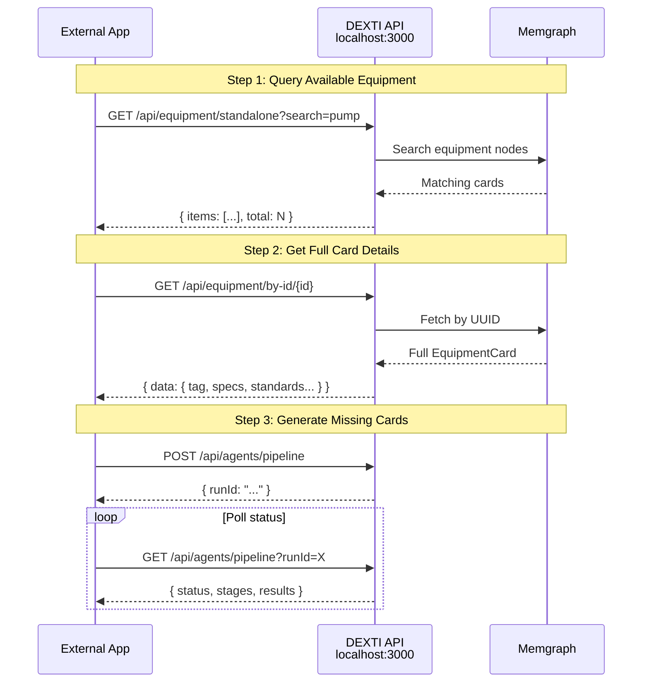
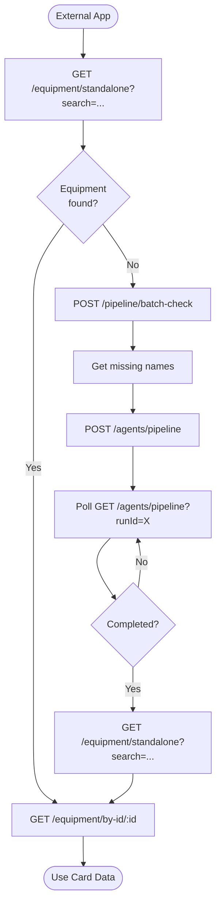

# External Application Integration Guide

[← Back to Index](./index.md)

> How external applications can query, browse, select, and acquire DEXPI 2.0 equipment cards via REST API.

---

## Overview

The DEXTI Equipment Factory exposes a standard REST API that any external application can use to:

1. **Query** — Search for available equipment by name, category, or specification
2. **Browse** — List and filter the equipment catalogue
3. **Select** — Retrieve full equipment card details
4. **Acquire** — Generate new cards for equipment that doesn't exist yet



---

## No Authentication (Current Version)

All API endpoints are currently open — no API keys, tokens, or headers required beyond standard `Content-Type: application/json`.

> **Note**: Authentication will be added in a future version. Design your integration to accept an `Authorization` header when it becomes required.

---

## Step 1: Query Available Equipment

### Search by Name

```bash
curl "http://localhost:3000/api/equipment/standalone?search=pump"
```

### Filter by Category

```bash
curl "http://localhost:3000/api/equipment/standalone?category=rotating"
```

### Paginated Results

```bash
curl "http://localhost:3000/api/equipment/standalone?page=1&pageSize=20"
```

### Response Format

```json
{
  "success": true,
  "data": {
    "items": [
      {
        "id": "uuid-1",
        "tag": "P-1001",
        "componentClass": "CentrifugalPump",
        "displayName": "Centrifugal Pump",
        "category": "rotating",
        "description": "Single-stage centrifugal pump...",
        "specifications": { "capacity": { "value": 500, "unit": "m³/h" } },
        "standards": ["API 610"],
        "manufacturers": ["Sulzer", "KSB"],
        "metadata": { "validationScore": 89, "source": "ai-generated" }
      }
    ],
    "total": 42,
    "page": 1,
    "pageSize": 20
  }
}
```

---

## Step 2: Get Full Equipment Card

Retrieve the complete DEXPI 2.0 equipment card by UUID:

```bash
curl "http://localhost:3000/api/equipment/by-id/{id}"
```

### Full Card Response

```json
{
  "success": true,
  "data": {
    "id": "uuid-1",
    "tag": "P-1001",
    "componentClass": "CentrifugalPump",
    "componentClassURI": "http://data.posccaesar.org/rdl/RDS416239",
    "displayName": "Centrifugal Pump",
    "category": "rotating",
    "description": "Single-stage, end-suction centrifugal pump...",
    "specifications": {
      "capacity": { "value": 500, "unit": "m³/h" },
      "head": { "value": 75, "unit": "m" },
      "speed": { "value": 2950, "unit": "rpm" },
      "efficiency": { "value": 82, "unit": "%" }
    },
    "operatingConditions": {
      "designPressure": 25,
      "operatingPressure": 18,
      "designTemperature": 200,
      "operatingTemperature": 150,
      "units": { "pressure": "barg", "temperature": "°C" }
    },
    "materials": {
      "body": "316L Stainless Steel",
      "internals": "Duplex 2205",
      "gaskets": "Spiral Wound PTFE"
    },
    "standards": ["API 610", "ASME B73.1", "ISO 5199"],
    "manufacturers": ["Sulzer", "KSB", "Flowserve"],
    "nozzles": [
      { "id": "N1", "size": "8in", "rating": "150#", "facing": "RF", "service": "Suction" },
      { "id": "N2", "size": "6in", "rating": "150#", "facing": "RF", "service": "Discharge" }
    ],
    "metadata": {
      "version": 1,
      "createdAt": "2026-02-14T00:00:00.000Z",
      "updatedAt": "2026-02-14T00:00:00.000Z",
      "createdBy": "pipeline-v2",
      "validationScore": 89,
      "source": "ai-generated"
    }
  }
}
```

---

## Step 3: Generate Missing Equipment

If the equipment you need doesn't exist, trigger the pipeline:

### Check What Exists First

```bash
curl -X POST "http://localhost:3000/api/pipeline/batch-check" \
  -H "Content-Type: application/json" \
  -d '{"items": ["Centrifugal Pump", "Heat Exchanger", "Reactor Vessel"]}'
```

### Generate Missing Cards

```bash
curl -X POST "http://localhost:3000/api/agents/pipeline" \
  -H "Content-Type: application/json" \
  -d '{
    "equipmentNames": ["Heat Exchanger", "Reactor Vessel"],
    "sectorHint": "Chemical",
    "minQualityScore": 80
  }'
```

**Response:**
```json
{ "runId": "run-uuid", "status": "queued", "mode": "batch", "itemCount": 2 }
```

### Poll for Completion

```bash
curl "http://localhost:3000/api/agents/pipeline?runId=run-uuid"
```

Poll every 2-3 seconds until `status` is `completed` or `failed`.

---

## Code Examples

### JavaScript (fetch)

```javascript
const BASE = 'http://localhost:3000/api';

// Search
const results = await fetch(`${BASE}/equipment/standalone?search=pump`)
  .then(r => r.json());

// Get full card
const card = await fetch(`${BASE}/equipment/by-id/${results.data.items[0].id}`)
  .then(r => r.json());

// Generate missing
const run = await fetch(`${BASE}/agents/pipeline`, {
  method: 'POST',
  headers: { 'Content-Type': 'application/json' },
  body: JSON.stringify({
    equipmentNames: ['Reactor Vessel'],
    sectorHint: 'Chemical',
  }),
}).then(r => r.json());

// Poll
const poll = async (runId) => {
  let status;
  do {
    await new Promise(r => setTimeout(r, 3000));
    const res = await fetch(`${BASE}/agents/pipeline?runId=${runId}`)
      .then(r => r.json());
    status = res.run?.status;
    console.log(`Status: ${status}`);
  } while (status === 'queued' || status === 'running');
  return status;
};
await poll(run.runId);
```

### Python (requests)

```python
import requests
import time

BASE = "http://localhost:3000/api"

# Search
results = requests.get(f"{BASE}/equipment/standalone", 
    params={"search": "pump"}).json()

# Get full card
card_id = results["data"]["items"][0]["id"]
card = requests.get(f"{BASE}/equipment/by-id/{card_id}").json()

# Generate missing
run = requests.post(f"{BASE}/agents/pipeline", json={
    "equipmentNames": ["Reactor Vessel"],
    "sectorHint": "Chemical",
}).json()

# Poll
run_id = run["runId"]
while True:
    time.sleep(3)
    status_res = requests.get(f"{BASE}/agents/pipeline", 
        params={"runId": run_id}).json()
    status = status_res.get("run", {}).get("status")
    print(f"Status: {status}")
    if status in ("completed", "failed", "cancelled"):
        break
```

### cURL Complete Workflow

```bash
# 1. Search for pumps
curl -s "http://localhost:3000/api/equipment/standalone?search=pump" | jq '.data.items[].displayName'

# 2. Check batch
curl -s -X POST "http://localhost:3000/api/pipeline/batch-check" \
  -H "Content-Type: application/json" \
  -d '{"items":["Centrifugal Pump","Reactor Vessel"]}' | jq '.data'

# 3. Generate missing
RUN_ID=$(curl -s -X POST "http://localhost:3000/api/agents/pipeline" \
  -H "Content-Type: application/json" \
  -d '{"equipmentNames":["Reactor Vessel"],"sectorHint":"Chemical"}' | jq -r '.runId')

# 4. Poll
while true; do
  STATUS=$(curl -s "http://localhost:3000/api/agents/pipeline?runId=$RUN_ID" | jq -r '.run.status')
  echo "Status: $STATUS"
  [ "$STATUS" = "completed" ] || [ "$STATUS" = "failed" ] && break
  sleep 3
done

# 5. Export as DEXPI XML
curl -s -X POST "http://localhost:3000/api/equipment/export" \
  -H "Content-Type: application/json" \
  -d '{"format":"dexpi-xml"}'
```

---

## Integration Flow Diagram



---

## API Capabilities Matrix

| Capability | Endpoint | Method |
|-----------|----------|--------|
| Search equipment | `/equipment/standalone` | GET |
| Get by UUID | `/equipment/by-id/:id` | GET |
| List categories | `/equipment/categories` | GET |
| Check existence | `/pipeline/batch-check` | POST |
| Generate cards | `/agents/pipeline` | POST |
| Check progress | `/agents/pipeline` | GET |
| Cancel generation | `/agents/pipeline` | DELETE |
| Update card | `/equipment/by-id/:id` | PUT |
| Delete card | `/equipment/by-id/:id` | DELETE |
| Export XML | `/equipment/export` | POST |
| Assign to facility | `/equipment/by-id/:id/assign` | POST |

---

## Related Pages

- [API Reference](./api-reference.md) — Full endpoint listing
- [Equipment API](./api-equipment.md) — Equipment CRUD details
- [Batch Processing](./pipeline-batch.md) — Batch pipeline internals
- [Graph Schema](./storage-graph-schema.md) — How cards are stored
