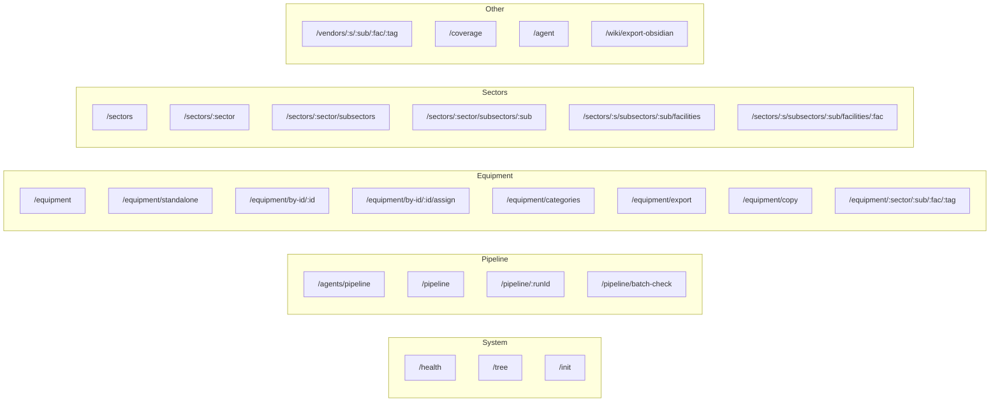

# API Reference

[← Back to Index](./index.md)

> All 25 REST API endpoints grouped by domain.

---

## Base URL

```
http://localhost:3000/api
```

All endpoints return JSON. No authentication required (current version).

---

## Endpoint Map



---

## System APIs

### `GET /api/health`

Health check endpoint.

| Field | Value |
|-------|-------|
| **Method** | GET |
| **Auth** | None |
| **Response** | `{ status: "ok", timestamp, memgraph: { connected, circuitBreaker } }` |

### `GET /api/tree`

Returns the full sector → subsector → facility → equipment hierarchy.

| Field | Value |
|-------|-------|
| **Method** | GET |
| **Response** | Nested tree structure with counts at each level |

### `POST /api/init`

Forces schema initialization and CISA sector seeding.

| Field | Value |
|-------|-------|
| **Method** | POST |
| **Response** | `{ success: true, message: "Schema initialized" }` |

---

## Pipeline APIs

### `POST /api/agents/pipeline`

Start a pipeline run. Auto-detects batch vs legacy mode.

**Batch Mode** (Equipment Factory):

```json
{
  "equipmentNames": ["Centrifugal Pump", "Heat Exchanger"],
  "sectorHint": "Chemical",
  "minQualityScore": 80
}
```

**Legacy Mode** (Single Item):

```json
{
  "sector": "CHEMICAL",
  "subSector": "REFINERY",
  "facility": "CDU",
  "equipmentClass": "CentrifugalPump",
  "quantity": 5
}
```

| Field | Value |
|-------|-------|
| **Method** | POST |
| **Response** | `{ runId, status: "queued", mode: "batch", itemCount: N }` |

### `GET /api/agents/pipeline`

Get pipeline run status.

| Param | Type | Required | Description |
|-------|------|----------|-------------|
| `runId` | query | Yes | Pipeline run ID |

**Response**: Full `PipelineV2Result` including stages and results.

### `DELETE /api/agents/pipeline`

Cancel a running pipeline.

| Param | Type | Required | Description |
|-------|------|----------|-------------|
| `runId` | query | Yes | Pipeline run ID |

### `POST /api/pipeline/batch-check`

Check which equipment names already exist in the database.

```json
{ "items": ["Centrifugal Pump", "Heat Exchanger"] }
```

**Response**: See [Batch Processing](./pipeline-batch.md#phase-2-database-check).

### `GET /api/pipeline`

List all pipeline runs.

### `GET /api/pipeline/:runId`

Get a specific pipeline run by ID.

---

## Equipment APIs

See [Equipment API](./api-equipment.md) for detailed CRUD documentation.

| Endpoint | Method | Description |
|----------|--------|-------------|
| `/equipment` | GET | List equipment (facility-scoped) |
| `/equipment/standalone` | GET, POST | Standalone equipment CRUD |
| `/equipment/by-id/:id` | GET, PUT, DELETE | Equipment by UUID |
| `/equipment/by-id/:id/assign` | POST, DELETE | Facility assignment |
| `/equipment/categories` | GET | Equipment category list |
| `/equipment/export` | POST | DEXPI XML export |
| `/equipment/copy` | POST | Copy equipment to facility |
| `/equipment/:sector/:sub/:fac/:tag` | GET, PUT, DELETE | Legacy tag-based access |

---

## Sector APIs

| Endpoint | Method | Description |
|----------|--------|-------------|
| `/sectors` | GET, POST | List or create sectors |
| `/sectors/:sector` | GET, PUT, DELETE | Single sector CRUD |
| `/sectors/:sector/subsectors` | GET, POST | Sub-sector list/create |
| `/sectors/:sector/subsectors/:sub` | GET, PUT, DELETE | Sub-sector CRUD |
| `/sectors/:s/subsectors/:sub/facilities` | GET, POST | Facility list/create |
| `/sectors/:s/subsectors/:sub/facilities/:fac` | GET, PUT, DELETE | Facility CRUD |

---

## Other APIs

| Endpoint | Method | Description |
|----------|--------|-------------|
| `/vendors/:s/:sub/:fac/:tag` | GET, POST | Vendor variation CRUD |
| `/coverage` | GET | Equipment coverage analysis |
| `/agent` | POST | AI chat agent endpoint |
| `/wiki/export-obsidian` | GET | Export wiki to Obsidian format |

---

## Common Response Format

All endpoints follow this pattern:

**Success:**
```json
{
  "success": true,
  "data": { ... },
  "timestamp": "2026-02-14T00:00:00.000Z"
}
```

**Error:**
```json
{
  "success": false,
  "error": "Description of what went wrong",
  "timestamp": "2026-02-14T00:00:00.000Z"
}
```

### Status Codes

| Code | Meaning |
|------|---------|
| 200 | Success |
| 201 | Created (new resource) |
| 400 | Bad Request (validation error) |
| 404 | Not Found |
| 500 | Internal Server Error |

---

## Related Pages

- [Equipment API](./api-equipment.md) — Detailed equipment endpoint docs
- [External Integration](./api-external-guide.md) — Guide for external apps
- [Pipeline Process](./pipeline-process.md) — Pipeline stage details
- [Batch Processing](./pipeline-batch.md) — Batch flow details
