# System Architecture

[← Back to Index](./index.md)

> System architecture, technology stack, and service topology for the DEXTI Equipment Factory.

---

## Architecture Overview

```mermaid
graph TB
    subgraph "Client Layer"
        Browser["🖥 Browser<br/>Next.js Frontend"]
        ExtApp["📱 External App<br/>REST Client"]
    end

    subgraph "Application Layer"
        NextJS["⚡ Next.js 14<br/>App Router + API Routes"]
        
        subgraph "AI Pipeline"
            PV2["Pipeline V2<br/>Batch Orchestrator"]
            RA["Research Agent"]
            GA["Generator Agent"]
            CA["Compliance Agent"]
            EA["Enrichment Agent"]
            QGA["Quality Gate Agent"]
            GWA["Graph Writer Agent"]
        end
    end

    subgraph "AI Services (External)"
        Gemini["🤖 Google Gemini<br/>Research + Analysis"]
        OpenRouter["🔗 OpenRouter<br/>Card Generation"]
    end

    subgraph "Data Layer"
        Memgraph["🗄 Memgraph<br/>Graph Database<br/>Bolt :7687"]
        FileStore["📁 File Storage<br/>/data"]
    end

    Browser --> NextJS
    ExtApp --> NextJS
    NextJS --> PV2
    PV2 --> RA --> Gemini
    PV2 --> GA --> OpenRouter
    PV2 --> CA --> OpenRouter
    PV2 --> EA --> OpenRouter
    PV2 --> QGA --> OpenRouter
    PV2 --> GWA --> Memgraph
    NextJS --> Memgraph
    NextJS --> FileStore
```



---

## Technology Stack

| Layer | Technology | Version | Purpose |
|-------|-----------|---------|---------|
| **Runtime** | Node.js | 20 LTS | Server runtime |
| **Framework** | Next.js | 14.2 | Full-stack React framework (App Router) |
| **UI** | React | 18.3 | Component library |
| **Styling** | Tailwind CSS | 3.4 | Utility-first CSS |
| **Animation** | Framer Motion | 11.0 | Page transitions, micro-animations |
| **Icons** | Lucide React | 0.344 | Icon system |
| **Database** | Memgraph | Latest | In-memory graph database (Neo4j-compatible) |
| **DB Driver** | neo4j-driver | 5.28 | Bolt protocol client |
| **AI (Research)** | Google Gemini | 0.24 | Equipment research + analysis |
| **AI (Generate)** | OpenRouter | — | LLM gateway for card generation |
| **Validation** | Zod | 3.22 | Runtime schema validation |
| **XML** | fast-xml-parser | 4.3 | DEXPI XML export |
| **Scheduling** | node-cron | 3.0 | Pipeline scheduling |
| **IDs** | uuid | 9.0 | UUID generation |
| **Build** | TypeScript | 5.4 | Type-safe development |

---

## Service Topology


### Port Map

| Service | Port | Protocol | Description |
|---------|------|----------|-------------|
| Next.js App | 3000 | HTTP | Web UI + REST API |
| Memgraph | 7687 | Bolt | Cypher query interface |
| Memgraph Lab | 7444 | HTTP | Visual graph explorer |

---

## Docker Build Pipeline

The Dockerfile uses a 3-stage multi-stage build:


| Stage | Base Image | Purpose | Output |
|-------|-----------|---------|--------|
| `deps` | `node:20-slim` | Install dependencies | `node_modules/` |
| `builder` | `node:20-slim` | Build Next.js | `.next/standalone` + `.next/static` |
| `runner` | `node:20-slim` | Production runtime | Standalone Node server |

**Runtime directories created in the container:**

```
/data/
├── sectors/          ← Sector data cache
├── pipeline-runs/    ← Pipeline run artifacts
└── exports/          ← DEXPI XML exports
```

---

## Data Flow Overview


---

## Standards Alignment

| Standard | Usage |
|----------|-------|
| **DEXPI 2.0** | Equipment classification, ComponentClass URIs |
| **ISO 10628** | Equipment category groups (rotating, static, heat-transfer, etc.) |
| **ISA 5.1** | Equipment tag naming (P-1001, E-2001, V-3001) |
| **PCA RDL** | Component class URIs (`http://data.posccaesar.org/rdl/...`) |
| **CISA** | 16 critical infrastructure sectors |

---

## Related Pages

- [Installation](./installation.md) — How to set up the system
- [Configuration](./configuration.md) — Environment variables and settings
- [Pipeline Process](./pipeline-process.md) — Detailed pipeline diagrams
- [Graph Schema](./storage-graph-schema.md) — Database model
- [AI Agents](./agents.md) — Agent architecture
