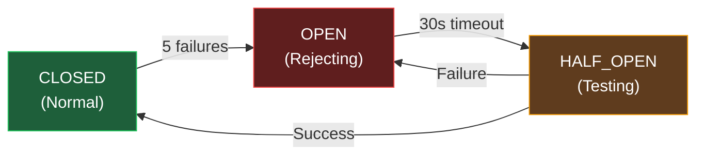

# Operations Guide

[← Back to Index](./index.md)

> Health checks, monitoring, pipeline scheduling, backup, and troubleshooting.

---

## Health Endpoints

### `GET /api/health`

Primary health check used by Docker and external monitors.

```bash
curl http://localhost:3000/api/health
```

**Response:**
```json
{
  "status": "ok",
  "timestamp": "2026-02-14T00:00:00.000Z",
  "memgraph": {
    "connected": true,
    "circuitBreaker": {
      "state": "CLOSED",
      "failureCount": 0,
      "lastFailureTime": 0,
      "THRESHOLD": 5,
      "TIMEOUT_MS": 30000
    }
  }
}
```

### `GET /api/tree`

Returns the full sector hierarchy — also serves as a deep health check (validates Memgraph reads).

### Docker Health Checks

| Service | Check | Interval |
|---------|-------|----------|
| `dexpi-memgraph` | `echo 'RETURN 1;' \| mgconsole` | 10s |
| `dexpi-equipment-factory` | `wget --spider http://localhost:3000/api/tree` | 30s |

---

## Monitoring

### Memgraph Lab

Access the visual graph explorer at `http://localhost:7444`:

- Run Cypher queries interactively
- Visualise the sector → equipment graph
- Monitor query performance
- Inspect node properties

### Graph Statistics

```bash
# Get node and relationship counts
curl http://localhost:3000/api/tree | jq '.nodeCount, .relCount'
```

### Circuit Breaker Monitoring

The circuit breaker state is included in the health endpoint:



| State | Behaviour |
|-------|-----------|
| `CLOSED` | Normal operation — all queries pass through |
| `OPEN` | Circuit tripped — queries are rejected immediately |
| `HALF_OPEN` | Testing — one query allowed, success closes circuit |

**Reset manually:**
```bash
# Via admin endpoint (if exposed)
# Or restart the application to reset
```

---

## Pipeline Scheduling

### Cron Schedule

The pipeline can run automatically via `node-cron`:

```env
PIPELINE_SCHEDULE=0 */6 * * *
```

| Expression | Meaning |
|-----------|---------|
| `0 */6 * * *` | Every 6 hours (default) |
| `0 * * * *` | Every hour |
| `0 0 * * *` | Daily at midnight |
| `*/30 * * * *` | Every 30 minutes |

### Manual Pipeline Runs

```bash
# Via API
curl -X POST http://localhost:3000/api/agents/pipeline \
  -H "Content-Type: application/json" \
  -d '{"equipmentNames": ["Centrifugal Pump"], "sectorHint": "Chemical"}'

# Check status
curl "http://localhost:3000/api/agents/pipeline?runId=RUNID"

# Cancel
curl -X DELETE "http://localhost:3000/api/agents/pipeline?runId=RUNID"
```

### Pipeline Run History

```bash
# List all runs
curl http://localhost:3000/api/pipeline | jq '.data'
```

---

## Backup & Restore

### Memgraph Data

Memgraph data is persisted in the `memgraph-data` Docker volume:

```bash
# Backup
docker run --rm -v memgraph-data:/data -v $(pwd)/backups:/backup \
  alpine tar czf /backup/memgraph-$(date +%Y%m%d).tar.gz -C /data .

# Restore
docker compose down
docker run --rm -v memgraph-data:/data -v $(pwd)/backups:/backup \
  alpine sh -c "cd /data && tar xzf /backup/memgraph-20260214.tar.gz"
docker compose up -d
```

### Application Data

Application data (pipeline runs, exports) is in the `dexpi-data` volume:

```bash
# Backup
docker run --rm -v dexpi-data:/data -v $(pwd)/backups:/backup \
  alpine tar czf /backup/dexpi-data-$(date +%Y%m%d).tar.gz -C /data .
```

### Re-seed from Scratch

```bash
# Delete all data and re-initialize
docker compose down -v  # Removes volumes
docker compose up -d
curl -X POST http://localhost:3000/api/init
```

---

## Troubleshooting

### Common Issues

| Symptom | Cause | Solution |
|---------|-------|----------|
| App won't start | Memgraph not ready | Wait for healthcheck, check `docker compose ps` |
| "Circuit breaker OPEN" | 5+ consecutive Memgraph failures | Check Memgraph logs, restart if needed |
| Pipeline stuck at "running" | LLM API timeout or error | Cancel run, check API keys in `.env.local` |
| "GEMINI_API_KEY not set" | Missing env variable | Add to `.env.local`, restart app |
| Empty search results | Schema not initialized | Call `POST /api/init` |
| Duplicate equipment | Tag collision | Check `generateEquipmentTag` prefix map |
| Slow queries | Missing indexes | Call `POST /api/init` to recreate indexes |
| Docker build fails | Node version mismatch | Ensure Dockerfile uses `node:20-slim` |
| Port conflict | Other service on 3000/7687 | `lsof -ti:3000 \| xargs kill` |

### Logs

```bash
# Application logs
docker compose logs -f app

# Memgraph logs
docker compose logs -f memgraph

# Local dev (stdout)
npm run dev 2>&1 | tee app.log
```

### Useful Cypher Queries

```cypher
-- Count all equipment
MATCH (e:Equipment) RETURN count(e) AS total;

-- List all equipment categories
MATCH (e:Equipment) RETURN DISTINCT e.category, count(e) ORDER BY count(e) DESC;

-- Find equipment by name
MATCH (e:Equipment) WHERE e.displayName CONTAINS 'Pump' RETURN e.tag, e.displayName;

-- Get sector hierarchy depth
MATCH (s:Sector)-[:HAS_SUBSECTOR]->(ss)-[:HAS_FACILITY]->(f)
RETURN s.code, count(DISTINCT ss), count(DISTINCT f);

-- Find orphaned equipment (no facility)
MATCH (e:Equipment) WHERE NOT (e)<-[:CONTAINS_EQUIPMENT]-() RETURN e.tag, e.displayName;

-- Pipeline run history
MATCH (r:PipelineRun) RETURN r.id, r.status, r.createdAt ORDER BY r.createdAt DESC LIMIT 10;
```

---

## Docker Compose Commands

| Command | Description |
|---------|-------------|
| `docker compose up -d` | Start all services |
| `docker compose down` | Stop all services |
| `docker compose down -v` | Stop + delete volumes |
| `docker compose ps` | Show service status |
| `docker compose logs -f` | Follow all logs |
| `docker compose logs -f app` | Follow app logs only |
| `docker compose restart app` | Restart app only |
| `docker compose build --no-cache` | Rebuild from scratch |
| `docker compose exec memgraph mgconsole` | Open Memgraph console |

---

## Related Pages

- [Installation](./installation.md) — Initial setup
- [Configuration](./configuration.md) — Environment variables
- [Architecture](./architecture.md) — Service topology
- [Storage Operations](./storage-operations.md) — Circuit breaker details
