# Batch Processing — Equipment Card Factory

[← Back to Index](./index.md)

> Equipment Factory batch processing flow, swimlane diagrams, and per-item pipeline orchestration.

---

## Overview

The Equipment Card Factory allows users to input multiple equipment names and generate DEXPI 2.0 cards in batch. The process has 4 logical phases:

```mermaid
graph LR
    I["📝 Input<br/>Names"] --> C["🔍 Check<br/>Database"]
    C --> P["⚡ Pipeline<br/>Generate"]
    P --> S["✅ Complete<br/>Cards Stored"]

    style I fill:#1e3a5f,stroke:#3b82f6,color:#fff
    style C fill:#5f3c1e,stroke:#f59e0b,color:#fff
    style P fill:#3c1e5f,stroke:#8b5cf6,color:#fff
    style S fill:#1e5f3a,stroke:#22c55e,color:#fff
```



---

## Phase 1: Input

Users provide equipment names through three input methods:

| Method | Format | Example |
|--------|--------|---------|
| **Text Input** | Comma, semicolon, newline, or pipe separated | `Centrifugal Pump, Heat Exchanger` |
| **CSV Upload** | First column of each row (headers auto-skipped) | `equipment.csv` |
| **Quick-add Chips** | Individual items added to a visual chip list | Click `+ Add` |

### Parsing Rules

- Names are split on `,` `;` `\n` `|`
- Leading/trailing whitespace is trimmed
- Empty strings are discarded
- Duplicates are removed (Set-based deduplication)
- CSV headers matching `/^(equipment|name|item|type|class|#)/i` are skipped

### Optional: Sector Hint

An optional sector hint (e.g., "Chemical", "Energy") can be provided to improve the Research Agent's accuracy. If omitted, the pipeline uses "General" context.

---

## Phase 2: Database Check


### Match Criteria

A name matches if any of these fields match case-insensitively:

| Field | Example |
|-------|---------|
| `displayName` | "Centrifugal Pump" |
| `componentClass` | "CentrifugalPump" |
| `tag` | "P-1001" |

### Batch Check Response

```json
{
  "success": true,
  "data": {
    "existing": [
      {
        "name": "Centrifugal Pump",
        "id": "uuid-here",
        "tag": "P-1001",
        "componentClass": "CentrifugalPump",
        "displayName": "Centrifugal Pump"
      }
    ],
    "missing": ["Heat Exchanger", "Pressure Vessel"],
    "total": 3,
    "existingCount": 1,
    "missingCount": 2
  }
}
```

---

## Phase 3: Batch Pipeline Execution

Only **missing** items are sent to the pipeline. Each item is processed sequentially through all 6 stages.

```mermaid
flowchart TD
    Start([Missing Items List]) --> Loop{"More items?"}
    
    Loop -->|"Yes"| Item["Take next equipment name"]
    Item --> R["🔍 Research"]
    R -->|"Failed"| Skip1["Skip item, continue"]
    R -->|"Success"| G["⚙️ Generate"]
    G -->|"Failed"| Skip2["Skip item, continue"]
    G -->|"Success"| V["✅ Validate"]
    V --> FilterV{"Cards passed<br/>validation?"}
    FilterV -->|"None"| Skip3["Skip item, continue"]
    FilterV -->|"Some"| E["🧬 Enrich"]
    E -->|"Failed"| Skip4["Skip item, continue"]
    E -->|"Success"| Q["🛡️ Quality Gate"]
    Q --> FilterQ{"Cards<br/>approved?"}
    FilterQ -->|"None"| Skip5["Skip item, continue"]
    FilterQ -->|"Some"| W["💾 Write to Graph"]
    W --> Agg["Aggregate results"]
    
    Skip1 --> Loop
    Skip2 --> Loop
    Skip3 --> Loop
    Skip4 --> Loop
    Skip5 --> Loop
    Agg --> Loop
    
    Loop -->|"No"| Done([Pipeline Complete])
```



### Batch Orchestration Details

| Feature | Implementation |
|---------|---------------|
| **Processing order** | Sequential (one item at a time) |
| **Error handling** | Per-item — failures skip to next item |
| **Cancellation** | Checked between each stage |
| **Progress tracking** | Stage messages include `[N/M]` progress indicator |
| **Score aggregation** | Running average across all validated items |
| **Result accumulation** | Counts increment per item (generated, validated, etc.) |

### Synthetic Parameters

For each equipment name, the batch runner creates synthetic `PipelineV2Params`:

```typescript
{
  sector: sectorHint || 'STANDALONE',
  subSector: 'STANDALONE',
  facility: 'STANDALONE',
  equipmentClass: equipmentName,  // From the batch list
  quantity: 1,
  minQualityScore: 80,
}
```

---

## Phase 4: Results

After all items are processed, the pipeline run transitions to `completed`:


### API Response (Poll Status)

```
GET /api/agents/pipeline?runId={runId}
```

```json
{
  "run": {
    "runId": "uuid",
    "status": "completed",
    "stages": {
      "research": { "status": "completed", "message": "[3/3] Pressure Vessel: 5 standards found" },
      "generate": { "status": "completed", "message": "[3/3] Pressure Vessel: 1 card(s) generated" },
      "validate": { "status": "completed", "message": "[3/3] Pressure Vessel: 1 passed" },
      "enrich": { "status": "completed", "message": "[3/3] Pressure Vessel: enriched" },
      "quality-gate": { "status": "completed", "message": "[3/3] Pressure Vessel: 1 approved" },
      "write": { "status": "completed", "message": "Batch complete: 3 cards written, 0 duplicates skipped" }
    },
    "results": {
      "generated": 3,
      "validated": 3,
      "enriched": 3,
      "approved": 3,
      "written": 3,
      "duplicatesSkipped": 0,
      "averageScore": 87
    }
  }
}
```

---

## Full Swimlane Diagram

```mermaid
sequenceDiagram
    participant User as User
    participant UI as Pipeline Page
    participant Check as Batch Check API
    participant Pipeline as Pipeline V2
    participant Agents as AI Agents
    participant DB as Memgraph

    User->>UI: Enter equipment names
    User->>UI: Click "Check Database"
    UI->>Check: POST /api/pipeline/batch-check
    Check->>DB: Search each name
    DB-->>Check: Match results
    Check-->>UI: existing[] + missing[]
    
    UI-->>User: Show split (existing vs missing)
    User->>UI: Click "Generate N Cards"
    UI->>Pipeline: POST /api/agents/pipeline<br/>{equipmentNames: missing[]}
    
    Pipeline-->>UI: {runId}
    
    loop Poll every 2s
        UI->>Pipeline: GET /api/agents/pipeline?runId=X
        Pipeline-->>UI: Current status + stage messages
    end
    
    loop For each missing item
        Pipeline->>Agents: Research → Generate → Validate → Enrich → Quality Gate
        Agents-->>Pipeline: Approved cards
        Pipeline->>DB: MERGE Equipment nodes
    end
    
    Pipeline-->>UI: status: "completed"
    UI-->>User: Show final results
```



---

## Limits

| Constraint | Value |
|-----------|-------|
| Max items per batch | 100 |
| Max items per batch check | 500 |
| Min quality score (default) | 80 |
| Poll interval | 2 seconds |

---

## Related Pages

- [Pipeline Process](./pipeline-process.md) — Detailed 6-stage process diagrams
- [API Reference](./api-reference.md) — Pipeline API endpoints
- [External Integration](./api-external-guide.md) — How external apps trigger batch runs
- [AI Agents](./agents.md) — Agent architecture
