# Pipeline Process — 6-Stage Flow

[← Back to Index](./index.md)

> Detailed process diagrams for the DEXPI 2.0 equipment card generation pipeline.

---

## Pipeline Overview

The V2 Pipeline is a sequential 6-stage AI-orchestrated process that generates DEXPI 2.0 compliant equipment cards. Each stage uses a specialist AI agent.

---

## Stage 1: Research 🔍

**Agent**: `ResearchAgent` → Google Gemini  
**Input**: Equipment class name + sector context  
**Output**: `ResearchReport`

### ResearchReport Structure

| Field | Type | Description |
|-------|------|-------------|
| `equipmentClass` | string | Normalized DEXPI class name |
| `pcaUri` | string | PCA RDL component class URI |
| `isaTagPrefix` | string | ISA 5.1 tag prefix (e.g., `P`, `E`, `V`) |
| `specifications` | object | Typical specs with units |
| `standards` | string[] | Applicable standards (API 610, ASME VIII, etc.) |
| `manufacturers` | string[] | Known vendors |
| `operatingRanges` | object | Typical operating conditions |
| `webSources` | string[] | Source URLs |

---

## Stage 2: Generate ⚙️

**Agent**: `PipelineV2.generateEquipmentCards()` → OpenRouter  
**Input**: `PipelineV2Params` + `ResearchReport`  
**Output**: `EquipmentCard[]`

```mermaid
flowchart TD
    Start([ResearchReport + Params]) --> Prompt["Build system + user prompt"]
    Prompt --> LLM["Call OpenRouter LLM<br/>(temperature: 0.4)"]
    LLM --> Parse["Parse JSON response"]
    Parse --> Clean["Clean markdown fences"]
    Clean --> Validate["Validate array structure"]
    
    Validate -->|"Valid"| Enrich["Inject metadata:<br/>• sector/subSector/facility<br/>• version: 1<br/>• source: pipeline-v2<br/>• createdAt: ISO-8601"]
    Validate -->|"Parse Error"| Fail([Throw Error])
    
    Enrich --> Out([EquipmentCard array])
```

### Card Generation Requirements

The LLM prompt enforces these **critical requirements**:

- Tags **MUST** follow ISA-5.1 format: `P-1001`, `E-2001`, `V-3001`
- `componentClassURI` **MUST** use PCA RDL format
- All specifications **MUST** include units
- Design conditions **MUST** exceed operating conditions
- Minimum 3 manufacturers, 3 standards, 3 specifications

---

## Stage 3: Validate ✅

**Agent**: `ComplianceAgent` → OpenRouter  
**Input**: Each `EquipmentCard`  
**Output**: `ComplianceReport`

```mermaid
flowchart TD
    Start([EquipmentCard]) --> Check["Compliance Agent<br/>validates card"]
    
    Check --> TagFmt{"ISA tag format<br/>valid?"}
    TagFmt -->|"Yes"| URI{"PCA RDL URI<br/>valid?"}
    TagFmt -->|"No"| Deduct1["Deduct points"]
    
    URI -->|"Yes"| Units{"All specs have<br/>units?"}
    URI -->|"No"| Deduct2["Deduct points"]
    
    Units -->|"Yes"| Design{"Design > Operating<br/>conditions?"}
    Units -->|"No"| Deduct3["Deduct points"]
    
    Design -->|"Yes"| Score["Calculate final score"]
    Design -->|"No"| Deduct4["Deduct points"]
    
    Deduct1 --> Score
    Deduct2 --> Score
    Deduct3 --> Score
    Deduct4 --> Score
    
    Score --> Pass{"Score ≥ threshold?"}
    Pass -->|"Yes"| Accept([✅ Card passes])
    Pass -->|"No"| Reject([❌ Card rejected])
```

### Compliance Checks

| Check | Weight | Description |
|-------|--------|-------------|
| ISA Tag Format | High | Tag must match `[PREFIX]-[NUMBER]` |
| PCA RDL URI | High | Must start with `http://data.posccaesar.org/rdl/` |
| Specification Units | Medium | Every spec value must have a `unit` field |
| Operating Conditions | Medium | Design pressure/temp > operating values |
| Description Length | Low | Must be ≥ 50 characters |
| Manufacturers | Low | Array must have ≥ 1 entry |
| Standards | Low | Array must have ≥ 1 entry |

---

## Stage 4: Enrich 🧬

**Agent**: `EnrichmentAgent` → OpenRouter  
**Input**: Validated `EquipmentCard` + `ResearchReport`  
**Output**: Enriched `EquipmentCard`

---

## Stage 5: Quality Gate 🛡️

**Agent**: `QualityGateAgent` → OpenRouter  
**Input**: Enriched `EquipmentCard` + minimum score  
**Output**: `QualityReport`

```mermaid
flowchart TD
    Start([Enriched Card]) --> Agent["Quality Gate Agent"]
    
    Agent --> Score["Calculate quality score<br/>(0-100)"]
    
    Score --> MinCheck{"Score ≥ minQualityScore<br/>(default: 80)?"}
    MinCheck -->|"Yes"| Approve([✅ Approved])
    MinCheck -->|"No"| Reject([❌ Rejected])
```

### Scoring Criteria

| Dimension | Weight | Points |
|-----------|--------|--------|
| Completeness | 30% | All required fields populated |
| Accuracy | 25% | Specs within realistic ranges |
| Standards compliance | 20% | Valid ISA tags, PCA URIs |
| Data richness | 15% | Number of specs, nozzles, materials |
| Metadata validity | 10% | Timestamps, version, source |

---

## Stage 6: Write 💾

**Agent**: `GraphWriterAgent` → Memgraph  
**Input**: Approved `EquipmentCard[]` + sector/facility context  
**Output**: `WriteReport`

### WriteReport Structure

| Field | Type | Description |
|-------|------|-------------|
| `nodesCreated` | number | Equipment nodes written to graph |
| `duplicatesSkipped` | number | Existing equipment skipped |
| `errors` | string[] | Any write errors encountered |

---

## Error Handling

Each stage wraps execution in try/catch with:

- **Audit logging** via `AuditLogger` (every stage logs start/end/duration)
- **Cancellation checks** between stages (via `isCancelled()`)
- **Stage status tracking** — each stage reports `pending → running → completed/failed/skipped`

---

## Related Pages

- [Batch Processing](./pipeline-batch.md) — Equipment Factory batch flow
- [AI Agents](./agents.md) — Agent architecture details
- [Storage Operations](./storage-operations.md) — How cards are written
- [API Reference](./api-reference.md) — Pipeline API endpoints
