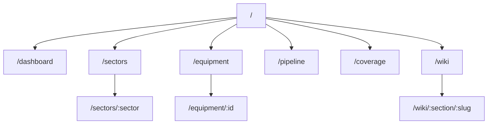
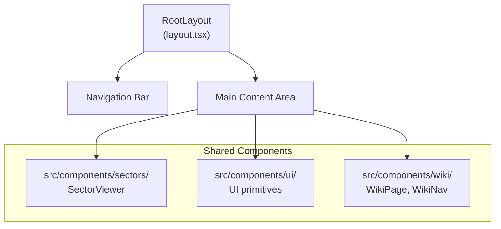

# Site Map — Frontend Routes

[← Back to Index](./index.md)

> Frontend page tree, component hierarchy, and navigation flow.

---

## Route Map



---

## Pages

### `/` — Home

The landing page with an overview of the DEXTI platform.

| Feature | Description |
|---------|-------------|
| Graph stats | Total nodes and relationships |
| Quick actions | Navigate to key features |
| Status indicators | Memgraph connection, pipeline status |

**File**: `src/app/page.tsx`

### `/dashboard` — Dashboard

System dashboard with metrics and recent activity.

| Feature | Description |
|---------|-------------|
| Equipment count | Total cards in database |
| Sector coverage | Coverage across CISA sectors |
| Recent pipeline runs | Latest generation results |
| Graph health | Circuit breaker state |

**File**: `src/app/dashboard/page.tsx`

### `/sectors` — Sector Browser

Browse the 16 CISA critical infrastructure sectors.

| Feature | Description |
|---------|-------------|
| Sector grid | Card-based sector overview |
| Drill-down | Click to explore sub-sectors → facilities |
| Equipment counts | Per-facility equipment totals |

**File**: `src/app/sectors/page.tsx`

### `/sectors/:sector` — Sector Detail

Deep-dive into a specific sector's hierarchy.

| Feature | Description |
|---------|-------------|
| Sub-sector tree | Expandable hierarchy |
| Facility list | All facilities with equipment counts |
| Equipment browser | View cards per facility |

**File**: `src/app/sectors/[sector]/page.tsx`

### `/equipment` — Equipment Browser

Browse and search all equipment cards.

| Feature | Description |
|---------|-------------|
| Search bar | Text search across all fields |
| Category filter | Filter by equipment category |
| Card grid | Equipment card previews |
| Detail view | Click for full card |

**File**: `src/app/equipment/page.tsx`

### `/pipeline` — Equipment Card Factory

The main pipeline interface — a 4-step wizard for generating DEXPI 2.0 cards.

| Step | Feature |
|------|---------|
| 1. Input | Equipment names (text, CSV, chips) + sector hint |
| 2. Check | Batch database check (existing vs missing) |
| 3. Running | Real-time 6-stage pipeline progress |
| 4. Complete | Results summary with card counts |

**File**: `src/app/pipeline/page.tsx`

### `/coverage` — Coverage Analysis

Equipment coverage analysis across sectors.

**File**: `src/app/coverage/page.tsx`

### `/wiki` — Internal Wiki

Internal wiki system for sector and equipment documentation.

| Feature | Description |
|---------|-------------|
| Section navigation | Browse by section |
| Page viewer | Markdown-rendered content |
| Backlinks | See pages linking to current page |
| Obsidian export | `GET /api/wiki/export-obsidian` |

**File**: `src/app/wiki/page.tsx` + `src/app/wiki/[section]/[slug]/page.tsx`

---

## Shared Layout

**File**: `src/app/layout.tsx`

All pages share a common layout with:

| Element | Description |
|---------|-------------|
| Navigation bar | Top navigation with page links |
| OXOT branding | Logo + "Predictive Cyber Assurance" |
| Active page indicator | Highlighted current route |
| Responsive design | Mobile-friendly layout |

### Navigation Items

| Label | Route |
|-------|-------|
| Home | `/` |
| Dashboard | `/dashboard` |
| Sectors | `/sectors` |
| Equipment | `/equipment` |
| Pipeline | `/pipeline` |
| Coverage | `/coverage` |
| Wiki | `/wiki` |

---

## Component Hierarchy



### Component Directories

| Directory | Contents |
|-----------|----------|
| `src/components/ui/` | Shared UI primitives (buttons, cards, etc.) |
| `src/components/sectors/` | Sector-specific components |
| `src/components/wiki/` | Wiki page renderer, navigation, backlinks |

---

## API Route Structure

```
src/app/api/
├── agent/route.ts                    ← AI chat agent
├── agents/pipeline/route.ts          ← Pipeline V2 operations
├── coverage/route.ts                 ← Coverage analysis
├── equipment/
│   ├── route.ts                      ← Equipment list
│   ├── standalone/route.ts           ← Standalone CRUD
│   ├── by-id/[id]/route.ts           ← UUID-based CRUD
│   ├── by-id/[id]/assign/route.ts    ← Facility assignment
│   ├── categories/route.ts           ← Category list
│   ├── copy/route.ts                 ← Copy equipment
│   ├── export/route.ts               ← DEXPI XML export
│   └── [sector]/.../route.ts         ← Legacy tag-based
├── health/route.ts                   ← Health check
├── init/route.ts                     ← Schema init
├── pipeline/
│   ├── route.ts                      ← Pipeline run list
│   ├── [runId]/route.ts              ← Single run detail
│   └── batch-check/route.ts          ← Batch existence check
├── sectors/
│   └── [sector]/.../route.ts         ← Full CRUD hierarchy
├── tree/route.ts                     ← Full graph tree
├── vendors/                          ← Vendor variations
└── wiki/export-obsidian/route.ts     ← Wiki export
```

---

## Related Pages

- [Architecture](./architecture.md) — System architecture
- [API Reference](./api-reference.md) — All API endpoints
- [Pipeline Process](./pipeline-process.md) — Pipeline page details
- [Operations](./operations.md) — Monitoring and health
