# Graph Schema — DEXPI 2.0 Knowledge Graph

[← Back to Index](./index.md)

> Memgraph graph model, node types, relationship types, and DEXPI 2.0 alignment.

---

## Graph Model Overview

```mermaid
graph TB
    Sector["🏛 Sector<br/>(16 CISA sectors)"]
    SubSector["📂 SubSector<br/>(68 sub-sectors)"]
    Facility["🏭 Facility<br/>(74 facilities)"]
    Equipment["⚙️ Equipment<br/>:TaggedPlantItem"]
    Nozzle["🔧 Nozzle"]
    Material["🧱 Material"]
    Standard["📋 Standard"]
    Manufacturer["🏢 Manufacturer"]
    VendorVar["📦 VendorVariation"]
    PipelineRun["🔄 PipelineRun"]
    WikiPage["📄 WikiPage"]

    Sector -->|"HAS_SUBSECTOR"| SubSector
    SubSector -->|"HAS_FACILITY"| Facility
    Facility -->|"CONTAINS_EQUIPMENT"| Equipment
    Equipment -->|"HAS_NOZZLE"| Nozzle
    Equipment -->|"MADE_OF"| Material
    Equipment -->|"CONFORMS_TO"| Standard
    Equipment -->|"MANUFACTURED_BY"| Manufacturer
    Equipment -->|"HAS_VARIATION"| VendorVar
    Equipment -->|"ASSIGNED_TO"| Facility
    Equipment -->|"BELONGS_TO_SECTOR"| Sector
    PipelineRun -->|"PRODUCED"| Equipment
    WikiPage -->|"LINKS_TO"| WikiPage
```

---

## Node Types

### Sector

| Property | Type | Description |
|----------|------|-------------|
| `code` | string | Unique sector code (e.g., `CHEMICAL`) |
| `name` | string | Display name |
| `icon` | string | Emoji icon |
| `description` | string | Sector description |
| `color` | string | Theme color (hex) |
| `srma` | string | Sector Risk Management Agency |

**Labels**: `:Sector`  
**Index**: UNIQUE on `code`

### SubSector

| Property | Type | Description |
|----------|------|-------------|
| `code` | string | Unique sub-sector code |
| `name` | string | Display name |
| `description` | string | Sub-sector description |

**Labels**: `:SubSector`  
**Index**: UNIQUE on `code`  
**Relationship**: `(Sector)-[:HAS_SUBSECTOR]->(SubSector)`

### Facility

| Property | Type | Description |
|----------|------|-------------|
| `code` | string | Unique facility code (e.g., `CDU`) |
| `name` | string | Display name |
| `description` | string | Facility description |

**Labels**: `:Facility`  
**Index**: UNIQUE on `code`  
**Relationship**: `(SubSector)-[:HAS_FACILITY]->(Facility)`

### Equipment

| Property | Type | Description |
|----------|------|-------------|
| `id` | string | UUID primary key |
| `tag` | string | ISA 5.1 tag (e.g., `P-1001`) |
| `componentClass` | string | DEXPI class name |
| `componentClassURI` | string | PCA RDL URI |
| `displayName` | string | Human-readable name |
| `category` | string | ISO 10628 category |
| `description` | string | Equipment description |
| `sector` | string | Parent sector code |
| `subSector` | string | Parent sub-sector code |
| `facility` | string | Parent facility code |
| `specifications` | JSON | Specs with units |
| `operatingConditions` | JSON | Design/operating parameters |
| `materials` | JSON | Material assignments |
| `standards` | JSON | Standards array |
| `manufacturers` | JSON | Manufacturer array |
| `nozzles` | JSON | Nozzle schedule |
| `metadata` | JSON | Version, timestamps, source |

**Labels**: `:Equipment:TaggedPlantItem`  
**Indexes**: UNIQUE on `id`, INDEX on `tag`, `componentClass`, `category`

### Nozzle

| Property | Type | Description |
|----------|------|-------------|
| `id` | string | Nozzle identifier (e.g., `N1`) |
| `size` | string | Nozzle size (e.g., `8in`) |
| `rating` | string | Pressure rating (e.g., `150#`) |
| `facing` | string | Flange facing (e.g., `RF`) |
| `service` | string | Service type (e.g., `Suction`) |

**Labels**: `:Nozzle`  
**Relationship**: `(Equipment)-[:HAS_NOZZLE]->(Nozzle)`

### Material

| Property | Type | Description |
|----------|------|-------------|
| `name` | string | Material name (e.g., `316L Stainless Steel`) |

**Labels**: `:Material`  
**Relationship**: `(Equipment)-[:MADE_OF {usage}]->(Material)`

### Standard

| Property | Type | Description |
|----------|------|-------------|
| `code` | string | Standard code (e.g., `API 610`) |

**Labels**: `:Standard`  
**Relationship**: `(Equipment)-[:CONFORMS_TO]->(Standard)`

### Manufacturer

| Property | Type | Description |
|----------|------|-------------|
| `name` | string | Company name (e.g., `Sulzer`) |

**Labels**: `:Manufacturer`  
**Relationship**: `(Equipment)-[:MANUFACTURED_BY]->(Manufacturer)`

### VendorVariation

| Property | Type | Description |
|----------|------|-------------|
| `vendor` | string | Vendor name |
| `model` | string | Model number |
| `specs` | JSON | Vendor-specific specs |

**Labels**: `:VendorVariation`  
**Relationship**: `(Equipment)-[:HAS_VARIATION]->(VendorVariation)`

### PipelineRun

| Property | Type | Description |
|----------|------|-------------|
| `id` | string | Run UUID |
| `status` | string | queued, running, completed, failed, cancelled |
| `params` | JSON | Run parameters |
| `results` | JSON | Aggregated counts |
| `createdAt` | string | ISO-8601 timestamp |

**Labels**: `:PipelineRun`  
**Relationship**: `(PipelineRun)-[:PRODUCED]->(Equipment)`

### WikiPage

| Property | Type | Description |
|----------|------|-------------|
| `slug` | string | URL slug |
| `title` | string | Page title |
| `section` | string | Wiki section |
| `level` | number | Hierarchy depth |
| `content` | string | Page content |

**Labels**: `:WikiPage`  
**Relationship**: `(WikiPage)-[:LINKS_TO]->(WikiPage)`

---

## Relationship Types

| Relationship | From | To | Description |
|-------------|------|-----|-------------|
| `HAS_SUBSECTOR` | Sector | SubSector | Sector hierarchy |
| `HAS_FACILITY` | SubSector | Facility | Facility hierarchy |
| `CONTAINS_EQUIPMENT` | Facility | Equipment | Facility's equipment |
| `HAS_NOZZLE` | Equipment | Nozzle | Nozzle schedule |
| `MADE_OF` | Equipment | Material | Material composition |
| `CONFORMS_TO` | Equipment | Standard | Standards compliance |
| `MANUFACTURED_BY` | Equipment | Manufacturer | Vendor relationship |
| `HAS_VARIATION` | Equipment | VendorVariation | Vendor-specific data |
| `ASSIGNED_TO` | Equipment | Facility | Assignment (many-to-many) |
| `BELONGS_TO_SECTOR` | Equipment | Sector | Sector membership |
| `PART_OF` | Equipment | Equipment | Component hierarchy |
| `PRODUCED` | PipelineRun | Equipment | Pipeline provenance |
| `LINKS_TO` | WikiPage | WikiPage | Wiki backlinks |
| `HAS_CHILD` | WikiPage | WikiPage | Wiki hierarchy |

---

## ISA 5.1 Tag Generation

Equipment tags follow the ISA 5.1 standard with deterministic generation:

| Prefix | Equipment Types |
|--------|----------------|
| `P` | Pump, CentrifugalPump |
| `E` | HeatExchanger, ShellAndTubeHeatExchanger |
| `V` | Vessel, PressureVessel |
| `C` | Compressor, CentrifugalCompressor |
| `T` | Tower, Column, DistillationColumn |
| `R` | Reactor |
| `TK` | Tank, StorageTank |
| `F` | Furnace, FiredHeater |
| `B` | Boiler |
| `D` | Drum, KnockoutDrum, FlashDrum |
| `FLT` | Filter |
| `AG` | Agitator, Mixer |
| `CV` | ControlValve |

Tags are formatted as `[PREFIX]-[NUMBER]` (e.g., `P-1001`).

---

## Seed Data

The schema is seeded with 16 CISA critical infrastructure sectors:

| Count | Entity |
|-------|--------|
| 16 | Sectors |
| 68 | Sub-sectors |
| 74 | Facilities |
| ~1,500+ | Equipment definitions per sector |

---

## Related Pages

- [Storage Operations](./storage-operations.md) — CRUD functions for all node types
- [Architecture](./architecture.md) — System overview
- [Pipeline Process](./pipeline-process.md) — How equipment is created
- [Equipment API](./api-equipment.md) — REST endpoints for equipment
