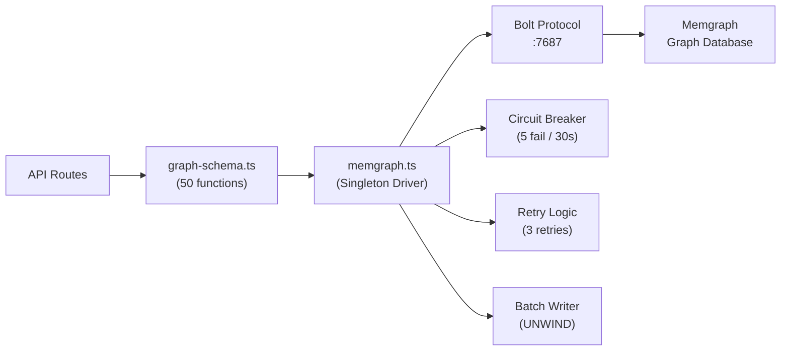
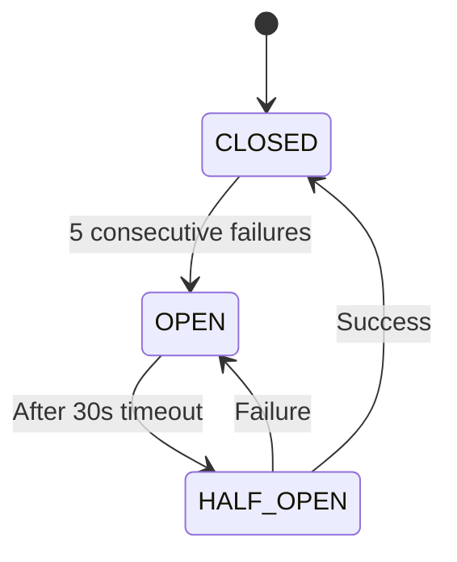
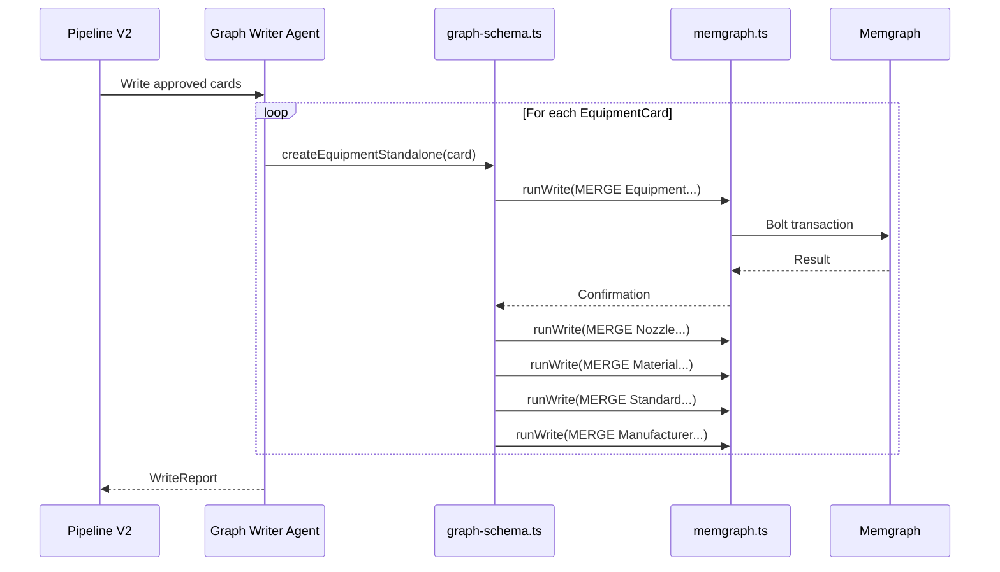

# Storage Operations

[← Back to Index](./index.md)

> All graph CRUD operations, batch writes, circuit breaker, and connection management.

---

## Architecture



---

## Memgraph Client (`memgraph.ts`)

### Connection Functions

| Function | Description |
|----------|-------------|
| `getDriver()` | Returns singleton Neo4j driver (HMR-safe via `globalThis`) |
| `getSession()` | Creates a new Memgraph session |
| `testConnection()` | Tests driver connectivity, returns `true/false` |
| `closeDriver()` | Gracefully closes connection pool |

### Query Functions

| Function | Description |
|----------|-------------|
| `runQuery(cypher, params)` | Execute read query with 3x retry + backoff |
| `runWrite(cypher, params)` | Execute write transaction with 3x retry + backoff |
| `runBatchWrite(cypher, batch, batchSize)` | Bulk import via UNWIND, chunked |

### Circuit Breaker

The client includes a circuit breaker to prevent cascading failures:



| Parameter | Value |
|-----------|-------|
| Failure threshold | 5 consecutive failures |
| Timeout | 30,000 ms (30 seconds) |
| Recovery | Single success resets to CLOSED |

| Function | Description |
|----------|-------------|
| `isCircuitOpen()` | Returns `true` if execution should proceed |
| `recordFailure()` | Increments failure count |
| `recordSuccess()` | Resets circuit to CLOSED |
| `getCircuitBreakerState()` | Returns state for health monitoring |
| `resetCircuitBreaker()` | Manual reset to CLOSED |

### Batch Write Operations

For bulk imports, `runBatchWrite` splits data into chunks and processes each in a single `UNWIND` transaction:

```typescript
const result = await runBatchWrite(
  'UNWIND $batch AS item MERGE (e:Equipment {id: item.id}) SET e += item',
  equipmentArray,
  100 // chunk size
);
// result: { processed: 250, failed: 0, errors: [] }
```

| Field | Type | Description |
|-------|------|-------------|
| `processed` | number | Successfully processed items |
| `failed` | number | Failed items |
| `errors` | Error[] | Error details for failed items |

---

## Graph Schema Functions (`graph-schema.ts`)

### Schema Management

| Function | Description |
|----------|-------------|
| `createIndexes()` | Creates constraint indexes (idempotent) |
| `initializeSchema()` | Full schema init: indexes + sector seeding |
| `seedSectorHierarchy()` | Seeds 16 sectors → 68 sub-sectors → 74 facilities |
| `getGraphStats()` | Returns `{ nodeCount, relCount }` |
| `getGraphTree()` | Returns full sector → equipment hierarchy |

### Sector Operations

| Function | Description |
|----------|-------------|
| `mergeSector(sector)` | MERGE sector node with multi-labels |
| `deleteSectorNode(code)` | Cascading delete sector + descendants |
| `mergeSubSector(sectorCode, subSector)` | MERGE sub-sector + link to sector |
| `deleteSubSectorNode(code)` | Cascading delete sub-sector |
| `mergeFacility(subSectorCode, facility)` | MERGE facility + link to sub-sector |
| `deleteFacilityNode(code)` | Cascading delete facility |

### Equipment Operations (Facility-Scoped)

| Function | Description |
|----------|-------------|
| `mergeEquipment(facilityCode, equipment)` | MERGE equipment with DEXPI 2.0 labels |
| `getEquipmentNode(tag, facilityCode)` | Get equipment by tag + facility |
| `listEquipmentNodes(facilityCode)` | List all equipment in a facility |
| `deleteEquipmentNode(tag, facilityCode)` | Delete equipment + children |
| `generateEquipmentTag(eq, facilityCode)` | Generate deterministic ISA tag |

### Equipment Operations (Standalone)

| Function | Description |
|----------|-------------|
| `createEquipmentStandalone(equipment)` | Create with UUID, no facility required |
| `getEquipmentById(id)` | Get by UUID with assignment info |
| `updateEquipmentNode(id, updates)` | Partial update by UUID |
| `deleteEquipmentById(id)` | Delete by UUID + children |
| `listAllEquipment(unassignedOnly)` | List all, optionally unassigned only |

### Equipment Relationships

| Function | Description |
|----------|-------------|
| `assignEquipmentToFacility(id, facilityCode)` | Create ASSIGNED_TO (many-to-many, idempotent) |
| `removeEquipmentFromFacility(id, facilityCode)` | Remove ASSIGNED_TO only |
| `mergeNozzle(tag, facilityCode, nozzle)` | MERGE nozzle + link to equipment |
| `mergeEquipmentMaterial(tag, fac, material, usage)` | Link to Material node |
| `mergeEquipmentStandard(tag, fac, standardCode)` | Link to Standard node |

### Vendor Variations

| Function | Description |
|----------|-------------|
| `mergeVendorVariationNode(tag, fac, variation)` | MERGE vendor variation + link |
| `listVendorVariationNodes(tag, fac)` | List variations for equipment |

### Pipeline Run Operations

| Function | Description |
|----------|-------------|
| `mergePipelineRunNode(run)` | MERGE pipeline run record |
| `getPipelineRunNode(id)` | Get run by ID |
| `listPipelineRunNodes()` | List all runs (sorted by date desc) |

### Search Operations

| Function | Description |
|----------|-------------|
| `searchEquipmentNodes(filter, page, pageSize)` | Faceted search with pagination |

### Wiki Operations

| Function | Description |
|----------|-------------|
| `mergeWikiPage(page)` | MERGE wiki page node |
| `addWikiBacklink(fromSlug, toSlug)` | Create LINKS_TO relationship |
| `getWikiBacklinks(slug)` | Get all pages linking to a page |

---

## Data Flow: Equipment Write Process



---

## Related Pages

- [Graph Schema](./storage-graph-schema.md) — Node and relationship types
- [Configuration](./configuration.md) — Memgraph connection settings
- [Pipeline Process](./pipeline-process.md) — Stage 6 (Write)
- [Operations](./operations.md) — Health checks and monitoring
